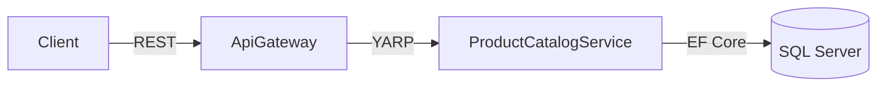

## Week at a Glance

- Implemented **ProductCatalogService** with full CRUD endpoints using Minimal API
- Adopted the **Result pattern** with `Result<T, TError>` for type-safe error handling
- Built the **Railway-Oriented Programming** pipeline for chaining async operations
- Created `CatalogError` domain error type with factory methods and localization keys
- Set up EF Core 10 with migrations and seed data for the catalog database
- Configured YARP routing in ApiGateway for catalog endpoints
- Added integration tests covering all CRUD operations

## Key Decisions

The most consequential decision this week was choosing the error handling strategy for all commerce services going forward.

> **Context:** IdentityService already used the `Result<T, TError>` pattern from the `Bazaar.Result` package, but it was the only consumer. New services could either follow the same pattern or use traditional try/catch with exceptions.
>
> **Decision:** Standardize on `Result<T, TError>` with Railway-Oriented Programming across all services.
>
> **Rationale:** The Result pattern makes error paths explicit in the type system. An endpoint returning `Result<Product, CatalogError>` forces the caller to handle both cases. Combined with ROP extension methods (`Map`, `Bind`, `Tap`, `Match`), it enables clean async pipelines that short-circuit on errors without nested try/catch blocks.
>
> **Consequences:** Steeper learning curve for contributors unfamiliar with ROP. We offset this with comprehensive documentation in `RESULT_PATTERN.md` and consistent examples in every service.

We also chose EF Core over Dapper for data access:

> **Context:** Catalog queries (filtered listings, paginated results) could benefit from Dapper's raw SQL performance, but EF Core offers migration tooling and consistency with IdentityService.
>
> **Decision:** Standardize on EF Core across all services.
>
> **Rationale:** Shared migration tooling, identical `Result<T, TError>` integration, and a single data access pattern for contributors to learn. LINQ expressions map well to the Specification pattern we plan to adopt for search.
>
> **Consequences:** We accept slightly higher query overhead. If specific catalog queries become bottlenecks, we can introduce Dapper for targeted hot paths without changing the overall architecture.



## What We Built

### ProductCatalogService

The catalog service moved from empty scaffold to fully operational. It follows the same three-layer error model established in IdentityService: domain error → API error → localized response.

The core of the service is a set of Minimal API endpoints that return `Result<T, CatalogError>`, which the `ToHttpResult()` extension converts to proper HTTP responses with correct status codes.

Here's the domain error type, following the factory method pattern from IdentityService:

```csharp
public record CatalogError : IHttpError
{
    public required string Code { get; init; }
    public Dictionary<string, object>? Details { get; init; }

    public static CatalogError ProductNotFound(Guid id) => new()
    {
        Code = "PRODUCT_NOT_FOUND",
        Details = new() { ["productId"] = id }
    };

    public static CatalogError DuplicateSku(string sku) => new()
    {
        Code = "DUPLICATE_SKU",
        Details = new() { ["sku"] = sku }
    };

    public static CatalogError InvalidPrice(decimal price) => new()
    {
        Code = "INVALID_PRICE",
        Details = new() { ["price"] = price }
    };

    public ApiError ToApiError() => Code switch
    {
        "PRODUCT_NOT_FOUND" => ApiError.NotFound(Code, "Errors.ProductNotFound", Details),
        "DUPLICATE_SKU" => ApiError.Conflict(Code, "Errors.DuplicateSku", Details),
        "INVALID_PRICE" => ApiError.Validation(Code, "Errors.InvalidPrice", Details),
        _ => ApiError.Validation("UNKNOWN_ERROR", "Errors.UnknownError", Details)
    };

    public IResult ToHttpResult() => /* status code mapping */;
}
```

Every error carries a localization key (`"Errors.ProductNotFound"`) rather than a hardcoded message. The frontend resolves these keys via `IStringLocalizer` in the user's language. Error messages were added for all four supported languages (en, ar, fr, tr).

## Patterns & Techniques

### Result Pattern and Railway-Oriented Programming

The `Result<T, TError>` type is the foundation of our error handling strategy. It's a discriminated union — a value is either a success `T` or an error `TError`, never both:

```csharp
public readonly record struct Result<T, TError>(T? Value, TError? Error)
{
    public bool IsOk => Error is null || EqualityComparer<TError>.Default.Equals(Error, default);
    public bool IsError => !IsOk;

    public static implicit operator Result<T, TError>(T value) => new(value, default);
    public static implicit operator Result<T, TError>(TError error) => new(default, error);

    public TResult Match<TResult>(
        Func<T, TResult> success,
        Func<TError, TResult> failure)
        => IsOk ? success(Value!) : failure(Error!);
}
```

The implicit conversions are key — they let you write `return product;` or `return CatalogError.ProductNotFound(id);` and the compiler handles the wrapping. No manual `Result.Ok()` or `Result.Fail()` calls needed.

Railway-Oriented Programming builds on this with chainable operations. Think of it as two parallel tracks — success and error. Each operation runs on the success track; if anything fails, execution jumps to the error track and stays there:

```csharp
// ...
// ROP pipeline in a catalog endpoint
return await ValidateRequest(request)          // Result<ValidatedRequest, CatalogError>
    .BindAsync(req => FindProduct(req.Id))     // Chain: continue on success, skip on error
    .Map(product => UpdateFields(product, req)) // Transform the success value
    .TapAsync(product => db.SaveChangesAsync()) // Side effect (save to DB)
    .Tap(product => logger.LogProductUpdated()) // Another side effect (logging)
    .MapError(err => EnrichWithContext(err))    // Transform errors if needed
    .ToHttpResult();                           // Convert to IResult with status code
// ...
```

The extension methods on `Task<Result<T, TError>>` make async chaining seamless — you never need to `await` intermediate results or write nested `if (result.IsOk)` checks.

### Three-Layer Error Model

Every service follows the same error architecture:

1. **Domain Error** — `CatalogError`, `IdentityError` — domain-specific, carries structured details
2. **API Error** — `ApiError` — standardized HTTP response with code, localization key, type, timestamp
3. **Localized Message** — Frontend resolves the localization key in the user's language

This separation means the backend never hardcodes user-facing text, and adding a new language is a JSON file change with zero code modifications.

## Considerations

> We chose EF Core over Dapper for consistency with IdentityService and shared migration tooling, accepting slightly higher query overhead for rapid development and type safety. If catalog queries become bottlenecks, Dapper can be introduced for targeted hot paths.

> The Result pattern adds a learning curve for contributors unfamiliar with functional error handling. We mitigate this with a 1,500-line `RESULT_PATTERN.md` guide, consistent examples in every service, and the fact that the compiler enforces error handling — you can't accidentally ignore an error.

## Validation

Integration tests cover all CRUD operations: create product with valid data, create with duplicate SKU (expects conflict), read by ID, read missing product (expects 404), update product fields, and delete. Each test verifies both the HTTP status code and the response body structure including localization keys.

Manual testing via Swagger confirmed the full flow through ApiGateway → YARP → ProductCatalogService → SQL Server and back.

## What's Next

- Add **product search** with composable filtering using the Specification pattern
- Implement **category management** with hierarchical category trees
- Add **pagination** with cursor-based navigation for large catalogs
- Begin planning **ShoppingCartService** architecture

## References

- [What's New in EF Core 10](https://learn.microsoft.com/en-us/ef/core/what-is-new/ef-core-10)
- [Microservice DDD and CQRS Patterns](https://learn.microsoft.com/en-us/dotnet/architecture/microservices/microservice-ddd-cqrs-patterns/)
