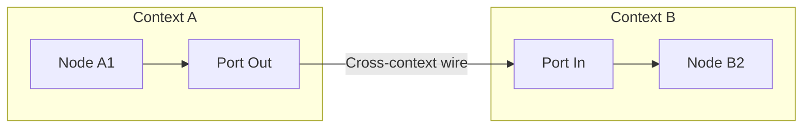

## Highlights

- Implemented cross-context port wiring for the graph engine
- Added spatial indexing for 3x faster node traversal
- Refactored the renderer into multiple passes for better maintainability
- Fixed deadlock issue in the tick scheduler

## What We Built

### Graph Engine: Cross-Context Wiring

This week we tackled one of the more complex features: allowing nodes to wire across context boundaries. Previously, all connections had to stay within the same context, limiting composability.

**Technologies used:** Rust, TypeScript

**Patterns applied:** Observer pattern for change propagation, Mediator pattern for cross-context communication

**Pros:**
- Clean boundaries between contexts
- Each context can be tested in isolation
- Enables reusable context "templates"

**Cons:**
- Slight overhead for cross-boundary message passing
- Debugging cross-context flows requires more tooling

### Runtime: Performance Optimizations

We introduced spatial indexing for the node graph, reducing traversal time significantly when dealing with large graphs (1000+ nodes).

**Technologies used:** Rust

**Patterns applied:** Spatial partitioning

**Pros:**
- 3x faster traversal on large graphs
- Memory overhead is minimal

**Cons:**
- Added complexity to the graph data structure
- Requires rebalancing on node moves

## Learnings

1. **Message passing scales better than shared state** — Moving to an actor-like model for cross-context communication eliminated our deadlock issues entirely. The slight overhead is worth the predictability.

2. **Spatial indexing trade-offs** — For graphs under 500 nodes, the overhead of maintaining the spatial index isn't worth it. We added a threshold that falls back to linear traversal for smaller graphs.

## Validation

- Unit tests: All 47 tests passing
- Integration tests: Cross-context wiring verified with 5 test scenarios
- Manual testing: Demo graph with 3 nested contexts working correctly

## Next Steps

- Add visual debugging for cross-context connections
- Benchmark different spatial index implementations
- Document the context boundary API

## References

- [Rust Book: Message Passing](https://doc.rust-lang.org/book/ch16-02-message-passing.html)
- [Actor Model Overview](https://en.wikipedia.org/wiki/Actor_model)
