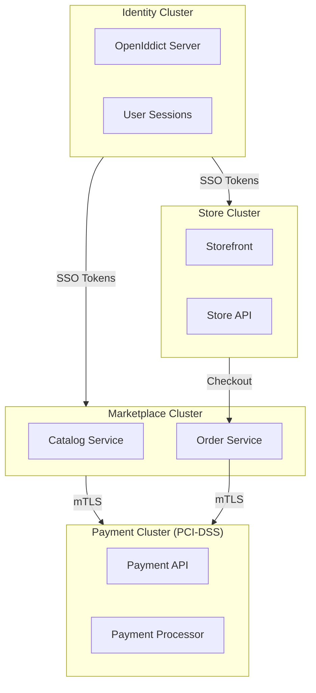
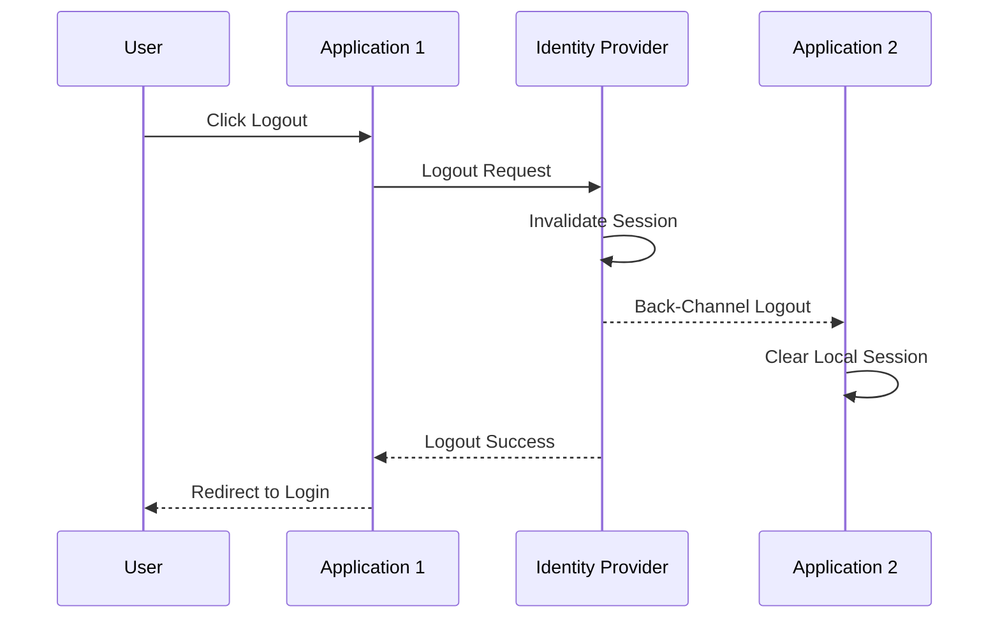

## Highlights

- **Introduced 5-cluster architecture** separating Identity, Payment, Marketplace, Store, and StorePlatform for better isolation and compliance
- **Payment cluster isolation** designed specifically for PCI-DSS compliance with mTLS cross-cluster communication
- **Back-channel logout** implemented for proper SSO sign-out across all connected applications
- **Completed OIDC migration** by removing legacy JWT/Auth services and token blacklist middleware
- **Multi-language identity pages** with localization support for English, Arabic, French, and Turkish
- **Load testing infrastructure** added with scripts and baseline results

## What We Built

### 5-Cluster Architecture for Marketplace Platform

This week marked a significant architectural evolution as we designed and documented a comprehensive 5-cluster architecture to support our marketplace platform. The clusters are:

1. **Identity Cluster** — Centralized authentication and SSO via OpenIddict
2. **Payment Cluster** — Isolated payment processing for PCI-DSS compliance
3. **Marketplace Cluster** — Core marketplace operations and catalog
4. **Store Cluster** — Individual store management and storefronts
5. **StorePlatform Cluster** — Platform-level store administration

The key insight driving this design is that **not all services have the same compliance requirements**. Payment processing requires PCI-DSS Level 1 compliance, which mandates strict isolation, audit logging, and security controls. By isolating the Payment cluster, we can apply these stringent requirements only where necessary, avoiding the overhead of blanket compliance across the entire platform.

**Technologies used:** .NET Aspire, Kubernetes (target deployment), mTLS

**Patterns applied:** Cluster Isolation, Bounded Context, Cross-Cluster Communication

**Pros:**
- PCI-DSS compliance isolated to Payment cluster only
- Independent scaling per cluster based on actual load
- Clear data ownership boundaries reduce complexity
- Security breach in one cluster doesn't compromise payment data

**Cons:**
- Increased operational complexity with multiple clusters
- Cross-cluster communication adds latency (mitigated by mTLS connection pooling)
- Requires careful orchestration during deployments

### OIDC Infrastructure Maturation

Building on the OpenIddict foundation from previous weeks, we added several critical features to make our SSO implementation production-ready.

Back-Channel Logout is the standout addition. When a user signs out from one application, the identity server now notifies all other connected applications to terminate their sessions. This prevents the common issue where a user logs out of one app but remains authenticated in others—a significant security gap in many SSO implementations.

We also introduced a User Sessions model with corresponding database migrations. This allows us to track active sessions across devices and applications, enabling features like "sign out from all devices" and session management dashboards.

**Technologies used:** OpenIddict, Entity Framework Core, ASP.NET Core Identity

**Patterns applied:** Back-Channel Logout (OIDC specification), Session Management

**Pros:**
- True single sign-out across all applications
- Centralized session management and visibility
- Follows OIDC specification for interoperability

**Cons:**
- Back-channel requests can fail if applications are temporarily unavailable
- Adds load to identity server during logout operations

### Identity Page Localization

The identity pages (login, register, verify OTP, reset password) now support four languages: English, Arabic, French, and Turkish. This required:

- Identity-specific localization resource files
- A new language service for runtime language detection and switching
- A shared layout component ensuring consistent UI across all identity pages

This follows our established pattern where the backend returns localization keys and the frontend handles all user-facing text. For identity pages rendered server-side, we use IStringLocalizer with the new identity-specific resource files.

**Technologies used:** ASP.NET Core Localization, Razor Pages

### Cleanup and Modernization

With OIDC fully operational, we removed substantial legacy code:

- **JWT/Auth services** — The custom token generation and validation code is no longer needed; OpenIddict handles this
- **Source generators** — Previously used for boilerplate reduction in the old auth system
- **Token blacklist middleware from ApiGateway** — OpenIddict's token revocation replaces this

This cleanup reduces our codebase complexity and maintenance burden while improving security by relying on a battle-tested library rather than custom implementations.

### Load Testing Infrastructure

We added load testing scripts and captured baseline results. While specific numbers aren't included here, having this infrastructure in place enables us to:

- Validate performance before releases
- Identify regression under load
- Benchmark the impact of architectural changes

## Learnings

1. **Cluster isolation is worth the complexity for compliance.** Initially, we considered applying PCI-DSS controls across the entire platform. However, the audit scope, operational overhead, and development velocity impact made cluster isolation the clear choice. The key is accepting that cross-cluster communication adds complexity and designing for it upfront with mTLS and proper service mesh tooling.

2. **Back-channel logout is non-negotiable for enterprise SSO.** Front-channel logout (browser redirects) is simpler but unreliable—users close browsers, networks fail, and sessions persist. Back-channel logout guarantees that when a user signs out, they're signed out everywhere. The implementation complexity is justified by the security guarantees.

3. **Removing code is as valuable as adding it.** The legacy JWT services worked, but maintaining two authentication systems (old JWT + new OIDC) created confusion and potential security gaps. Taking the time to fully migrate and remove the old system reduced our attack surface and simplified onboarding for new team members.

## Validation

- OIDC login, registration, and logout flows manually tested across multiple browser sessions
- Back-channel logout verified by signing out from one application and confirming session termination in others
- Localization tested for all four languages on identity pages
- Load testing scripts executed with baseline results captured
- Database migrations validated in development environment

## Next Steps

- Implement the remaining marketplace services following the cluster architecture
- Add monitoring and alerting for cross-cluster communication health
- Expand load testing to cover checkout flow through Payment cluster
- Document operational runbooks for cluster management

## References

- [OpenIddict Documentation](https://documentation.openiddict.com/)
- [OpenID Connect Back-Channel Logout](https://openid.net/specs/openid-connect-backchannel-1_0.html)
- [PCI Security Standards](https://www.pcisecuritystandards.org/)
- [.NET Aspire](https://learn.microsoft.com/en-us/dotnet/aspire/)
