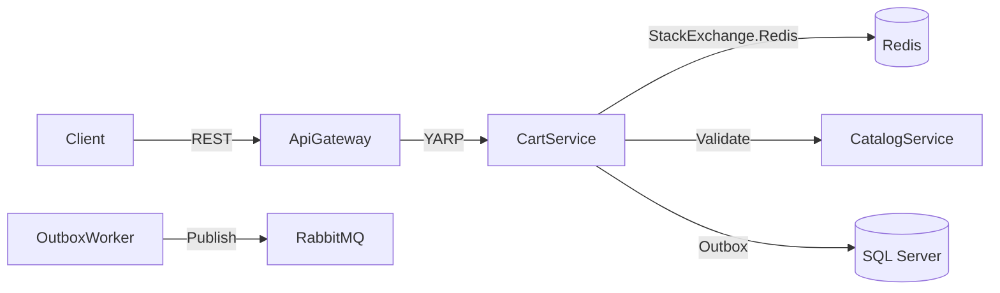

## Week at a Glance

- Implemented **ShoppingCartService** with Redis-backed session persistence and configurable TTL
- Added **cart-to-catalog validation** — items are verified against the product catalog before adding
- Built **cart event publishing** via the Transactional Outbox pattern (`cart.updated`, `cart.cleared`)
- Fixed a **concurrency bug** where simultaneous add operations could corrupt cart quantities
- Configured YARP routing for cart endpoints in ApiGateway
- Added integration tests for all cart flows including TTL expiration

## Key Decisions

The biggest decision this week was where to store cart state.

> **Context:** Carts are high-frequency, low-durability data. Users add and remove items constantly, but a cart has no value after checkout or abandonment. SQL Server would provide ACID guarantees but at the cost of write amplification for every quantity change.
>
> **Decision:** Use Redis hash sets for cart storage, with the Transactional Outbox for event publishing.
>
> **Rationale:** Redis hashes give us O(1) per-item operations. Each user's cart is a hash where product IDs are fields and quantities are values. `HINCRBY` handles atomic quantity updates without read-modify-write cycles. TTL handles abandoned cart cleanup automatically — no background job needed.
>
> **Consequences:** Cart data is not durable. A Redis restart loses all active carts. We accept this because cart data is ephemeral and easily reconstructable. For checkout, we snapshot the cart into a durable order record before clearing.



## What We Built

### ShoppingCartService

The cart service follows the same patterns as ProductCatalogService — Minimal API endpoints returning `Result<T, CartError>`, with the ROP pipeline handling validation, storage, and event publishing.

The Redis interaction uses the Cache-Aside pattern: the service is a stateless API layer applying business rules, and Redis is the sole source of cart truth.

```csharp
public async Task<Result<Cart, CartError>> AddItemAsync(
    string userId, AddItemRequest request)
{
    return await ValidateProduct(request.ProductId)
        .Map(product => new CartItem(product.Id, product.Name, product.Price, request.Quantity))
        .TapAsync(item => redis.HashIncrementAsync(
            CartKey(userId), item.ProductId.ToString(), item.Quantity))
        .TapAsync(_ => redis.KeyExpireAsync(CartKey(userId), cartTtl))
        .TapAsync(_ => PublishCartUpdatedEvent(userId))
        .BindAsync(_ => GetCartAsync(userId));
}
```

The `ValidateProduct` step calls ProductCatalogService to verify the product exists and is in stock. This is a synchronous HTTP call (not event-driven) because the user needs immediate feedback. If the catalog service is down, the add fails with a clear error rather than accepting an invalid item.

### Cart Event Publishing

Cart events (`cart.updated`, `cart.cleared`) are published via the Transactional Outbox pattern. The event is written to the outbox table in the same database transaction as the cart operation, then the OutboxWorker picks it up and publishes to RabbitMQ. This guarantees at-least-once delivery — even if RabbitMQ is temporarily down, events are not lost.

These events will be consumed later by the OrderService (for checkout flow) and potentially by an analytics service (for abandoned cart tracking).

## Fixes

### Cart Quantity Race Condition

During load testing, we discovered that two simultaneous "add to cart" requests for the same product could result in incorrect quantities. The issue was a classic read-modify-write race:

1. Request A reads quantity: 2
2. Request B reads quantity: 2
3. Request A writes quantity: 2 + 1 = 3
4. Request B writes quantity: 2 + 1 = 3 (should be 4)

The fix was straightforward: replace the read-modify-write with Redis `HINCRBY`, which atomically increments the hash field. No application-level locking needed — Redis handles the atomicity at the command level.

```csharp
// Before: read-modify-write race condition
var current = await redis.HashGetAsync(key, productId);
await redis.HashSetAsync(key, productId, current + quantity);

// After: atomic increment, no race
await redis.HashIncrementAsync(key, productId, quantity);
```

## Considerations

> We chose Redis over SQL Server for cart storage, accepting the loss of cart data on Redis restart. Carts are ephemeral — they exist between browsing and checkout. At checkout, the cart is snapshotted into a durable order record. The tradeoff gives us sub-millisecond operations and automatic abandoned-cart cleanup via TTL, eliminating the need for a background cleanup job.

## Validation

Integration tests cover the full cart lifecycle: add item, add duplicate item (quantity increments), remove item, clear cart, and TTL expiration. The TTL test sets a 2-second TTL, adds an item, waits 3 seconds, and verifies the cart is empty.

The concurrency fix was validated with a load test: 100 concurrent "add item" requests for the same product, verifying the final quantity equals exactly 100 across 1,000 iterations.

Catalog validation was tested by attempting to add a non-existent product ID — the endpoint returns `404` with `PRODUCT_NOT_FOUND` before touching Redis.

## What's Next

- Begin **gateway security hardening** — rate limiting and token refresh improvements
- Add **cart merge** for guest-to-authenticated user transitions
- Plan **OrderService** architecture — state machine for order lifecycle
- Investigate **response caching** at the gateway for catalog read endpoints

## References

- [Redis Hash Data Type](https://redis.io/docs/latest/develop/data-types/hashes/)
- [Transactional Outbox Pattern](https://microservices.io/patterns/data/transactional-outbox.html)
