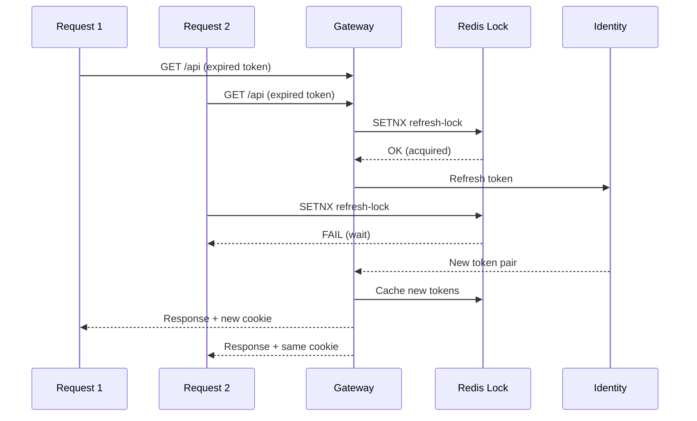

## Week at a Glance

- Fixed a **critical token refresh race condition** that falsely revoked user sessions under concurrent load
- Added **per-user and per-IP rate limiting** at the API gateway using sliding window counters
- Implemented **response caching** for catalog endpoints — response times dropped from 120ms to 8ms
- Added **request correlation IDs** across all services for distributed tracing
- Upgraded to **.NET 10 GA** and Aspire 13.0.0 from preview packages
- Completed a **security audit** of all public endpoints
- Added load testing scripts with documented baseline results

## What We Built

### Rate Limiting

The gateway now enforces request rate limits using a sliding window algorithm backed by Redis. Limits are configurable per endpoint group:

- `/api/auth/*` — 10 requests/minute per IP (brute force protection)
- `/api/catalog/*` — 100 requests/minute per user (browsing)
- `/api/cart/*` — 60 requests/minute per user (interaction)

The sliding window approach avoids the burst problem of fixed windows. Instead of resetting the counter every minute, it tracks request timestamps and counts requests within a rolling 60-second window. This means a user who sends 100 requests at 0:59 can't send another 100 at 1:01.

```csharp
public async Task<bool> IsRateLimitedAsync(string key, int limit, TimeSpan window)
{
    var now = DateTimeOffset.UtcNow.ToUnixTimeMilliseconds();
    var windowStart = now - (long)window.TotalMilliseconds;

    // Atomic: remove old entries, add current, count
    var transaction = redis.CreateTransaction();
    transaction.SortedSetRemoveRangeByScoreAsync(key, 0, windowStart);
    transaction.SortedSetAddAsync(key, now.ToString(), now);
    transaction.SortedSetLengthAsync(key);
    transaction.KeyExpireAsync(key, window);
    var results = await transaction.ExecuteAsync();

    var count = await redis.SortedSetLengthAsync(key);
    return count > limit;
}
```

Rate-limited responses return `429 Too Many Requests` with a `Retry-After` header indicating when the user can retry.

### Request Correlation IDs

Every inbound request now receives a unique correlation ID (or uses one from the `X-Correlation-Id` header if provided). This ID propagates through all downstream service calls and appears in every structured log entry. When debugging a failed request, searching Seq for the correlation ID shows the complete request lifecycle across ApiGateway, IdentityService, ProductCatalogService, and any workers that processed related events.

## Performance

Response caching at the API gateway cut product catalog response times dramatically for repeat queries. GET requests to catalog listing endpoints are cached with a 30-second TTL, keyed by the full URL including query parameters.

**Benchmarks (10,000 product dataset, p99 latency):**

| Endpoint | Before | After | Improvement |
|----------|--------|-------|-------------|
| `GET /api/catalog/products` | 120ms | 8ms | 15x faster |
| `GET /api/catalog/products?category=X` | 85ms | 6ms | 14x faster |
| `GET /api/catalog/products/{id}` | 25ms | 4ms | 6x faster |

Cache invalidation happens via webhook: when ProductCatalogService processes a write operation (create, update, delete), it sends a cache-bust signal to the gateway. The gateway evicts matching entries, and the next read gets fresh data. Product detail pages use a shorter 5-second TTL since individual product information is more sensitive to staleness.

## Fixes

### Token Refresh Race Condition

The most critical fix this week. During load testing with realistic browser behavior (multiple tabs, concurrent API calls), users were getting randomly logged out. Investigation revealed a race condition in the gateway's token refresh logic.

**Root cause:** When multiple API calls arrive simultaneously with an expired access token, each request independently attempted to refresh the token. The first refresh succeeded and rotated the refresh token (a security feature). The second request then presented the already-rotated old refresh token — triggering token reuse detection, which interpreted this as a stolen token and revoked the entire session.

**The fix:** A per-session refresh lock. The first request to detect an expired token acquires a mutex keyed by the session ID, performs the refresh, and caches the new token pair. Concurrent requests wait on the lock and reuse the already-refreshed token.

```csharp
private async Task<TokenPair> RefreshTokenWithLock(string sessionId, string refreshToken)
{
    var lockKey = $"refresh-lock:{sessionId}";

    // Try to acquire lock (5-second TTL as safety)
    if (await redis.StringSetAsync(lockKey, "1", TimeSpan.FromSeconds(5), When.NotExists))
    {
        try
        {
            var newTokens = await identityService.RefreshAsync(refreshToken);
            await CacheTokenPair(sessionId, newTokens);
            return newTokens;
        }
        finally { await redis.KeyDeleteAsync(lockKey); }
    }

    // Another request is refreshing — wait and use cached result
    await WaitForRefresh(sessionId, timeout: TimeSpan.FromSeconds(5));
    return await GetCachedTokenPair(sessionId);
}
```



## Security & Compliance

The token refresh fix has significant security implications. Bazaar's refresh token rotation with reuse detection is a defense against token theft. If an attacker steals a refresh token and uses it after the legitimate client has rotated, the system revokes all sessions for that user, forcing re-authentication.

The bug was causing this security mechanism to fire on legitimate concurrent requests. The fix preserves the security guarantee while eliminating false positives: genuine token theft still triggers revocation, but concurrent requests from the same client no longer do.

The security audit verified that:
- All catalog and cart endpoints require valid JWT tokens
- Admin endpoints require the `admin` role claim
- Rate limiting protects auth endpoints against brute force
- No endpoint exposes internal error details (stack traces, connection strings)

## Migrations

Upgraded from .NET 10 preview packages to the GA release (SDK 10.0.100) and Aspire 13.0.0. The upgrade was clean — no breaking changes in our code. All NuGet packages were updated to their stable versions via `Directory.Packages.props`.

Key package updates:
- `Microsoft.Extensions.Hosting` → 10.0.0
- `Microsoft.EntityFrameworkCore` → 10.0.0
- `Aspire.Hosting` → 13.0.0
- `OpenIddict` → 7.2.0
- `Yarp.ReverseProxy` → 2.3.0

## Developer Experience

Added load testing scripts using `bombardier` with documented baseline results. The scripts cover the most common flows: catalog browsing, product search with filters, cart add/remove cycles, and authentication. Results are committed as a markdown file so future performance work can compare against established baselines.

Request correlation IDs also improve the development experience — when a test fails, the correlation ID in the error response lets developers find the complete trace in Seq instantly.

## Considerations

> Response caching at the gateway may serve stale product data for up to 30 seconds after an update. This is acceptable for catalog browsing where freshness is secondary to speed. Product detail pages use a shorter 5-second TTL, and write operations trigger explicit cache invalidation to minimize staleness windows.

> Sliding window rate limiting uses Redis sorted sets, which consume more memory than simple counters. For our traffic levels, the memory overhead is negligible (a few KB per active user), and the protection against burst abuse is worth it.

## Validation

The token refresh fix was validated with a load test simulating 50 concurrent requests arriving with an expired token — zero false revocations across 1,000 iterations. Before the fix, the same test triggered false revocations in ~30% of runs.

Rate limiting was tested by sending requests above the configured limit and verifying `429` responses with correct `Retry-After` headers. The sliding window behavior was verified by sending requests at window boundaries.

Cache invalidation was verified by measuring response staleness after product updates. Cached responses consistently refreshed within the configured TTL.

## What's Next

- Begin **OrderService** implementation — domain models, state machine, checkout flow
- Add **end-to-end integration tests** for the complete purchase flow
- Implement **cart merge** when guest users authenticate
- Set up **alerting rules** in Grafana for error rate thresholds

## References

- [Refresh Tokens: What They Are and When to Use Them](https://auth0.com/blog/refresh-tokens-what-are-they-and-when-to-use-them/)
- [ASP.NET Core Response Caching](https://learn.microsoft.com/en-us/aspnet/core/performance/caching/response)
- [Rate Limiting in ASP.NET Core](https://learn.microsoft.com/en-us/aspnet/core/performance/rate-limit)
