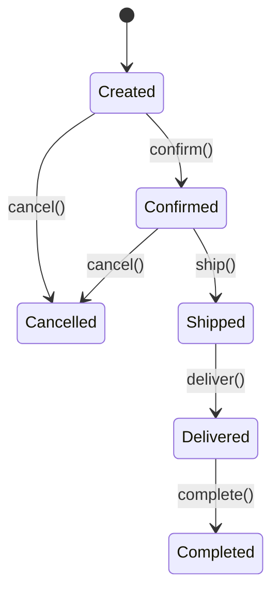
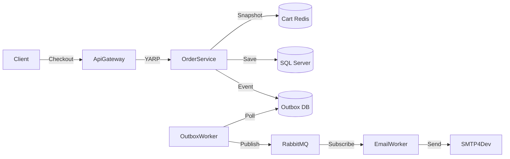

## Week at a Glance

- Implemented **OrderService** with domain models for Order, OrderItem, and OrderStatus
- Built an **order state machine** governing the lifecycle: Created → Confirmed → Shipped → Delivered → Completed
- Connected **cart-to-order checkout flow** — cart snapshots become immutable order records
- Published **order events** via the Transactional Outbox for downstream processing
- Wired **order confirmation emails** through EmailWorker via RabbitMQ
- Added **end-to-end integration tests** covering the full purchase flow
- Removed legacy test stubs and unused service scaffolding

## Key Decisions

The order lifecycle required a formal state machine rather than ad-hoc status updates.

> **Context:** Order status transitions have business rules — an order can't be shipped before it's confirmed, a delivered order can't be cancelled, a refund requires the order to be in a specific state. Ad-hoc string-based status fields invite invalid transitions.
>
> **Decision:** Implement a state machine using enum states with explicit transition validation.
>
> **Rationale:** The state machine makes invalid transitions impossible at the type level. Each transition is a method that checks the current state, applies the transition, and publishes the corresponding event. The method returns `Result<Order, OrderError>`, so invalid transitions produce a clear error rather than silently corrupting data.
>
> **Consequences:** Adding a new state (e.g., "Refund Requested") requires updating the state enum, adding transition methods, and defining new events. This is intentionally high-ceremony — order state changes have financial implications and should require deliberate implementation.



We also decided to snapshot the cart at checkout rather than referencing live cart data:

> **Context:** The order needs to record exactly what the customer purchased, at what price. If the order referenced the cart (which is in Redis), a price change or product removal after checkout would retroactively change the order.
>
> **Decision:** At checkout, copy cart items into `OrderItem` records with frozen prices.
>
> **Rationale:** Order records must be immutable after creation. The price the customer saw is the price they pay. This also means cart data can be cleaned up immediately after checkout without affecting the order.
>
> **Consequences:** Slight data duplication (product name and price stored in both catalog and order). This is intentional — the order is a historical record, not a live view.

## What We Built

### OrderService

The order service is the third and final commerce service. It follows the same patterns: Minimal API endpoints, `Result<T, OrderError>` return types, ROP pipelines, and the three-layer error model.

The checkout endpoint is the most interesting — it chains together cart retrieval, validation, order creation, event publishing, and cart cleanup in a single ROP pipeline:

```csharp
private static async Task<IResult> CheckoutAsync(
    [AsParameters] CheckoutParams p)
{
    return await p.CartService.GetCartAsync(p.UserId)
        .Bind(cart => ValidateCartNotEmpty(cart))
        .Map(cart => SnapshotCartToOrder(cart, p.UserId))
        .TapAsync(order => p.DbContext.Orders.AddAsync(order))
        .TapAsync(_ => p.DbContext.SaveChangesAsync())
        .TapAsync(order => PublishOrderCreatedEvent(order, p.Outbox))
        .TapAsync(_ => p.CartService.ClearCartAsync(p.UserId))
        .Tap(order => p.Logger.LogOrderCreated(order.Id, p.UserId))
        .Map(order => new OrderResponse(order.Id, order.Status, order.Total))
        .ToHttpResult();
}
```

If the cart is empty, `ValidateCartNotEmpty` returns `CartEmpty` error and the entire pipeline short-circuits — no order is created, no events are published, no cart is cleared. The ROP pattern makes this explicit without nested `if` blocks.

### Order State Machine

State transitions are methods on the `Order` entity that return `Result<Order, OrderError>`. Invalid transitions are rejected with a typed error:

```csharp
// ...
public Result<Order, OrderError> Confirm()
{
    if (Status != OrderStatus.Created)
        return OrderError.InvalidTransition(Status, OrderStatus.Confirmed);

    Status = OrderStatus.Confirmed;
    ConfirmedAt = DateTime.UtcNow;
    return this;
}

public Result<Order, OrderError> Ship(string trackingNumber)
{
    if (Status != OrderStatus.Confirmed)
        return OrderError.InvalidTransition(Status, OrderStatus.Shipped);

    Status = OrderStatus.Shipped;
    TrackingNumber = trackingNumber;
    ShippedAt = DateTime.UtcNow;
    return this;
}
// ...
```

Each transition method publishes a corresponding event via the outbox: `order.confirmed`, `order.shipped`, `order.delivered`. The EmailWorker subscribes to `order.confirmed` and sends an order confirmation email with the order summary, using the customer's preferred language.

### Order Confirmation Email Flow

The end-to-end flow demonstrates the full event-driven architecture:

1. Customer calls `POST /api/orders/checkout`
2. OrderService creates order, writes event to outbox table
3. OutboxWorker polls outbox, publishes `order.confirmed` to RabbitMQ
4. EmailWorker receives event, renders Razor template in customer's language
5. Email sent via SMTP (SMTP4Dev in development)



## What We Removed

With all three commerce services now operational, we cleaned up the scaffolding remnants:

- Deleted empty `Program.cs` stubs from the original service scaffolds (replaced by real implementations)
- Removed placeholder TODO comments that had been sitting in `AppHost.cs` for weeks
- Cleaned up unused NuGet package references in service `.csproj` files that were copy-pasted during initial scaffolding
- Removed test helper utilities that were duplicated across service test projects, consolidating them into a shared `TestHelpers` library

The shared test helpers alone eliminated ~80 lines of duplicated setup code (creating test servers, seeding databases, mocking Redis).

## Patterns & Techniques

### State Machine for Order Lifecycle

The state machine pattern works particularly well with the Result type. Each transition method is a pure function: given the current state, it either succeeds (returns the order with updated state) or fails (returns an error explaining why the transition is invalid).

This makes state transitions testable in isolation:

```csharp
[Fact]
public void Cannot_Ship_Unconfirmed_Order()
{
    var order = CreateTestOrder(OrderStatus.Created);
    var result = order.Ship("TRACK-123");

    Assert.True(result.IsError);
    Assert.Equal("INVALID_TRANSITION", result.Error!.Code);
}
```

The state machine also integrates cleanly with ROP pipelines. An endpoint that confirms and ships an order in one call (for admin use) chains the transitions:

```csharp
// ...
return await FindOrder(orderId)
    .Bind(order => order.Confirm())
    .Bind(order => order.Ship(trackingNumber))
    .TapAsync(order => db.SaveChangesAsync())
    .ToHttpResult();
// ...
```

If `Confirm()` fails (e.g., order is already cancelled), `Ship()` never runs. The pipeline short-circuits and returns the confirmation error.

## Validation

End-to-end integration tests cover the complete purchase flow: browse catalog → add to cart → checkout → verify order created → verify email sent. The test creates real products in the catalog, adds them to a cart via the API, calls the checkout endpoint, and verifies the order record in SQL Server and the email event in the test RabbitMQ instance.

State machine transitions are tested exhaustively: every valid transition and every invalid transition. The invalid transition tests verify that the correct `OrderError` is returned with the expected state pair in the error details.

The checkout flow was tested with edge cases: empty cart (expects `400`), cart with out-of-stock item (expects `409`), and concurrent checkouts with the same cart (expects the second to fail with `CART_EMPTY`).

## What's Next

- Add **payment integration** — placeholder for Stripe/PayPal adapter
- Implement **order cancellation** with inventory restoration
- Build an **admin dashboard** for order management (list, filter, status updates)
- Add **order history** endpoint for customers to view past purchases

## References

- [State Machine Pattern](https://refactoring.guru/design-patterns/state)
- [Transactional Outbox Pattern](https://microservices.io/patterns/data/transactional-outbox.html)
- [Domain-Driven Design with .NET](https://learn.microsoft.com/en-us/dotnet/architecture/microservices/microservice-ddd-cqrs-patterns/)
