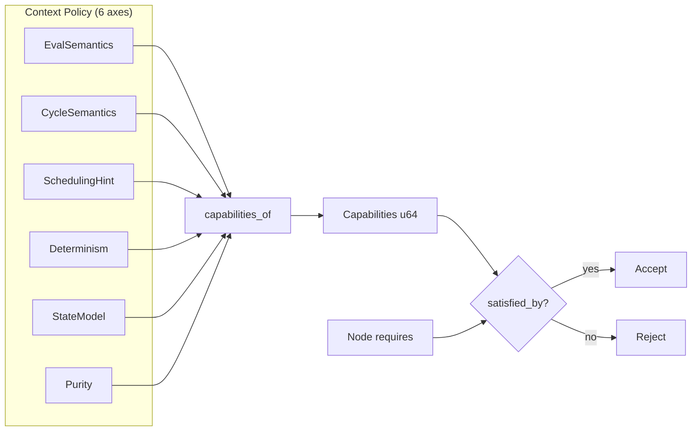

## Week at a Glance

- Split the monolithic crate into three with strict dependency boundaries — types, graph engine, and shipped parts library
- Replaced name-based deny lists with a six-axis semantic policy model that derives node compatibility from behavioral contracts
- Built a capabilities bitflags system that unifies all node-context compatibility into a single bitwise check
- Eliminated every eval_fn closure from builtin nodes — all 31 combinational operations now compile to baked slot-indexed ops
- Added a palette system with prefab extraction, blueprint instantiation, and user-saved context presets
- Expanded from ~190 tests to 505 across the workspace

## Key Decisions

### Semantic Policy Over Name Matching

**Context:** Context policies used a set of denied type names to control which nodes could exist inside them. DataFlow denied "builtin.register", FPGA allowed everything — simple, but fundamentally broken. The engine can't know ahead of time what type names users will create, so every custom node was either implicitly allowed everywhere or required manual deny-list maintenance.

**Decision:** Replace the deny list with a semantic contract model. Policies describe execution behavior through six composable axes — evaluation semantics, cycle semantics, scheduling, determinism, state model, and purity. Node compatibility is determined by behavioral requirements, not by string matching.

**Rationale:** A register node doesn't need to be *named* in a deny list. It needs latched state semantics. If a context provides latched state, registers work. If it doesn't, they're rejected — regardless of what the node is called. This inverts the contract: instead of "these specific names are banned," it's "this context provides these capabilities, and this node requires these capabilities."

**Consequences:** Adding a new context type means choosing values for six axes. Adding a new node type means declaring what capabilities it needs. The compatibility check is a single bitwise operation — `(requires & provides) == requires`. No code changes needed anywhere when either side grows.



### The Crate Split

**Context:** All types, graph operations, compilation, execution, and shipped builtins lived in one crate (plus a dead re-export facade). This meant the UI depended on everything, node factories lived alongside graph internals, and compilation changes required rebuilding type definitions.

**Decision:** Split into three crates: a leaf crate for types and policies, a middle crate for graph storage and execution, and a top crate for the shipped node library and palette system.

**Rationale:** The dependency graph should mirror the conceptual architecture. Types don't need to know about graphs. Graphs don't need to know about which nodes ship by default. Each crate compiles independently, and the boundaries are enforced at compile time — you literally can't import a catalog entry from the graph engine.

**Consequences:** Cross-crate refactoring requires more thought about where types live. The orphan rule means we can't add methods to types defined in the leaf crate from the middle crate — standalone functions fill that gap. But the payoff is real: incremental builds are faster, and the architecture is self-documenting through import paths.

## What We Built

### The Capabilities System

The six policy axes feed into a capabilities derivation function that produces a 64-bit flags value. Thirty-three capability bits span five groups — evaluation modes, cycle handling, scheduling targets, determinism guarantees, and state models. Implication rules handle the nuances: a Latched state model implies Stateless support (if you can latch, you can certainly run stateless nodes). A Deterministic context implies BestEffort support (stronger guarantee subsumes weaker).

Node requirements are the flip side. Each node declares which capabilities it needs — a register needs `TICKED | LATCHED`, a combinational node needs nothing. Compatibility reduces to one instruction: bitwise AND and compare.

```rust
// ...
fn satisfied_by(self, provides: Capabilities) -> bool {
    (self & provides) == self
}
// ...
```

This replaced three separate validation mechanisms — a hint compatibility check, a policy requirements struct with nested JSON, and hardcoded register checks. All three are gone, replaced by the single bitwise path.

### Palette System

Users needed a way to discover what nodes are available in a given context, save their own compositions for reuse, and load pre-built connected subgraphs as starting points. The palette system bridges shipped builtins with user-created content through three sources: an in-memory catalog of primitives filtered by context capabilities, a file-based store for user-saved custom nodes grouped by policy label, and a directory-scanned collection of blueprints — self-contained subgraphs with edge wiring and boundary port declarations.

Prefab extraction lets users select nodes in a graph and save the subgraph as a self-contained blueprint. The extraction captures full node specifications, internal edges, and boundary connections. Instantiation reverses the process, producing a batch of graph commands through the standard command pipeline — no special insertion path needed.

### Control Flow Primitives

The primitive operation vocabulary grew from arithmetic and bitwise operations to cover the full set of CPU scalar operations. Four new families landed: six comparison operators, four boolean logic gates, a conditional select (mux), and six type cast operations. Every one of these compiles to a baked operation with direct slot-indexed access — no closure allocation, no intermediate collections.

Boolean logic reuses the bitwise operation discriminants rather than introducing a separate enum. An AND gate on boolean ports is the same machine operation as a bitwise AND on integer ports — the only difference is the port type annotations in the catalog. This kept the execution layer unchanged while the catalog grew.

```rust
// ...
// Comparison compiles to a baked op — no closure, no allocation
BakeHint::BinaryCmp { op, lhs_port, rhs_port, out_port } => {
    let lhs = port_to_slot[&lhs_port];
    let rhs = port_to_slot[&rhs_port];
    let out = port_to_slot[&out_port];
    EvalOp::BinaryCmp { op, lhs, rhs, out }
}
// ...
```

## What We Removed

### The Shadow Interpreter

The node type enum had an `eval()` method that implemented a HashMap-based interpreter — a completely separate execution path from the real compiler. Tests passed against this interpreter while the actual compiled evaluation went undertested. We deleted it along with its nine unit tests. The real compiler is now the only execution path, and tests exercise it directly.

### NodeSpec Trait and Port Duplication

Nodes stored their ports in two places: inside the node struct and inside the embedded spec struct. A factory function would build ports, stuff them into the spec, then copy them into the node. Serialization wrote both copies. We deleted the trait, made the node the single port owner, and changed factories to return `(inputs, outputs, spec)` tuples that the node constructor assembles. JSON size dropped and there's exactly one source of truth for a node's ports.

### Three Parallel Validation Mechanisms

The hint compatibility check, the PolicyRequirements struct, and the hardcoded register checks all did roughly the same thing — determine whether a node can live in a context. All three are gone, replaced by the capabilities bitflags path described above.

## Patterns & Techniques

### Baked Compilation

The compiler reads port IDs and constant values directly from a node's compile hint — a declarative struct that describes what the node *is* rather than what it *does*. The hint says "I'm a binary math operation on these two ports producing output on this port." The compiler maps those port IDs to signal table slots at compile time and emits a baked operation that reads and writes slots by index at runtime.

This is the data-driven compiler pattern: the compiler has zero knowledge of specific node types. It doesn't import any node definitions. It matches on hint variants (constant, register, combinational-with-bake-hint, no-op) and mechanically translates port references to slot indices. Adding a new math operation means adding a discriminant to the operation enum and a match arm in the execution loop — the compiler itself doesn't change.

```rust
// The compiler never imports node types — it reads hints
// BakeHint carries everything needed for compilation
enum BakeHint {
    UnaryMathConst,  // one-input math with baked constant
    BinaryMath,      // two-input math
    UnaryMath,       // single-input math (negate, abs, etc.)
    BinaryBitwise,   // two-input bitwise
    UnaryBitwise,    // single-input bitwise (not, popcount, etc.)
    BinaryCmp,       // comparison → bool output
    Select,          // condition → pick A or B
    UnaryCast,       // type conversion
}
```

### Semantic Axis Composition

Each policy axis is an independent enum with a small number of variants. Coherence validation catches nonsensical combinations (GPU scheduling with deterministic guarantee, feedback cycles without latched state). The axes compose freely within the coherence constraints — you can build contexts that the original two-preset system never anticipated, like a stateful streaming context with event-driven evaluation and side-effecting purity.

## Performance

The execution hot path went from HashMap-based evaluation to slice-based dispatch. The old `EvalFn` signature took a `HashMap<PortId, Value>` for inputs and returned another HashMap for outputs — two allocations per custom node per settle pass. The new signature takes `&[Value]` and `&mut [Value]`, reading and writing positionally by slot index. Benchmarks showed 5–9% improvement on custom eval-fn nodes at scale, and the baked builtin path was already zero-allocation.

All 31 combinational builtin nodes now execute through baked `EvalOp` variants with `unsafe` direct slot access. The `EvalOp::Custom` path still exists for user-defined nodes, but no shipped node uses it. The execution loop is a flat match over roughly 20 operation variants, each doing one arithmetic or logical operation on pre-resolved slots.

## Fixes

### Inverted Capability Implication

The capabilities derivation had a subtle bug: BestEffort contexts were providing the `DETERMINISTIC` bit, while Deterministic contexts were not providing `BEST_EFFORT`. This meant a node requiring deterministic execution would be incorrectly accepted by a best-effort GPU context. The fix inverted the implication to match the actual guarantee hierarchy — Deterministic is the stronger guarantee and subsumes BestEffort, not the other way around.

## Considerations

> We chose slice-based evaluation over named-port lookup, accepting that ports must have deterministic compile-time ordering. All ports already did — the HashMap overhead was pure waste, a holdover from an earlier design that prioritized flexibility over performance.

> We chose to reuse BitwiseOp discriminants for boolean logic gates rather than introducing a separate LogicOp enum. This adds four match arms to existing bitwise handlers but avoids a redundant type and keeps the execution layer unchanged. Boolean AND on single-bit values is bitwise AND — the abstraction distinction lives in the catalog's port type annotations, not in the execution engine.

> PolicyViolation is a leaf-crate enum that the graph engine must wrap with node ID context at each call site. This adds a `map_err` per validation call, but cleanly separates domain logic ("this policy rejects this node because it lacks latched state") from graph-level error context ("...and that node is node #42 named 'my_register'").
