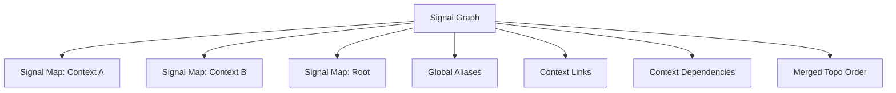

## Week at a Glance

- Refactored the signal flow layer from a flat whole-graph map to **per-context scoped maps** with a global aggregation layer
- Added a **context dependency graph** with O(1) sibling-to-sibling dependency queries — the routing table for future multi-domain orchestration
- Removed the `ValidatedGraph` wrapper — the graph is now **valid-by-construction** through its command API
- Switched all internal hash maps to **FxHash** and added edge adjacency caching for O(k) incremental cycle checks
- Built **worklist-driven boundary convergence** — 10x faster settle at nesting depth 10
- Shipped the full **execution pipeline**: context plans, event-driven dirty propagation, batch execution, and parallel context evaluation

## Key Decisions

### Per-Context Signal Maps Over Flat Analysis

**Context:** Our signal flow analysis layer sat between the graph and the compiler — a single flat structure covering every node and edge in the entire graph. This worked, but it meant every structural change triggered a full O(V+E) rebuild, and there was no way to reason about individual contexts independently.

**Decision:** We split the signal map into per-context instances, each scoped to a context node's direct children. A new aggregate structure collects these maps and manages cross-context concerns: global alias resolution, context dependency tracking, and a merged topological order.

**Rationale:** The system supports 25+ domain types (AI, FPGA, DataFlow, Reactive, GPU, among others), each running inside context nodes with different execution semantics. Per-context scoping means deleting a context is O(1) — just drop its map. Rebuilding after local edits scales with context size, not graph size. And the dependency graph between sibling contexts gives us exactly the information a future orchestrator needs to determine execution order and parallelism.

**Consequences:** Alias resolution became more complex — alias chains now cross context boundaries, so we process contexts bottom-up (DFS post-order) with cross-context lookups. The derived data rebuild is currently all-or-nothing, but the dependency graph itself enables targeted rebuilds when we need them.



### Valid-by-Construction Over Validation Ceremony

**Context:** Compiling a graph required a mandatory validation ceremony — mutate, run six validation passes, wrap in a validated type, then compile. But most of those checks were already duplicated at mutation time in the command API.

**Decision:** Remove the validation wrapper entirely. The command API *is* the validation layer. We kept the validation function as a diagnostic utility and added debug assertions in the compiler as a dev-build safety net.

**Rationale:** The wrapper added indirection for zero runtime benefit. Every check it performed — cycle detection, port compatibility, self-loop prevention — was already enforced when the mutation happened. The pipeline simplified from `mutate → validate(6 passes) → wrap → compile` to just `mutate → compile`.

**Consequences:** Simpler API surface, fewer allocations, and a clearer architectural story. If someone bypasses the command API (they shouldn't), debug builds will catch it. We also closed two mutation-time gaps we discovered during the audit: self-loop detection on edge connection and capability validation on node insertion.

## What We Built

### The Signal Graph Layer

The biggest piece of work this week was the signal graph — a new aggregate layer that owns per-context signal maps and manages everything that crosses context boundaries.

Each context node gets its own signal map tracking connectivity, topological order, and temporal edges for its direct children. The aggregate layer then builds three cross-cutting structures on top: global aliases that resolve through nested boundaries, context links that track every data flow entering a context, and a dependency graph between sibling contexts.

The dependency tracking uses a relay chain walk rather than alias resolution. When a context receives data from a sibling, we trace the raw connectivity chain through any relays to find the source context. This is more robust than following aliases, which can dead-end at boundary ports with non-alias sync modes. The result is a simple pair of maps — deps and reverse-deps — with O(1) lookup:

```rust
// ...
pub fn depends_on(&self, ctx_a: NodeId, ctx_b: NodeId) -> bool {
    self.context_deps
        .get(&ctx_a)
        .map_or(false, |deps| deps.contains(&ctx_b))
}
// ...
```

### Full Execution Pipeline

We also shipped the complete execution pipeline for heterogeneous context graphs. Previously the compiler only supported flat oneshot and ticked evaluation — contexts with event-driven or batch semantics had no execution path.

The new system uses phased execution plans driven by each context's evaluation semantics. A context plan sequences through boundary draining, settling (oneshot or dirty-propagation), latching, re-settling, and boundary flushing. Event-driven contexts use a dirty worklist for O(k) propagation through only affected downstream steps. Batch contexts scatter work across lane-cloned signal tables with optional parallel execution via rayon.

For parallel multi-context evaluation, we built a slot-level safety guard that ensures disjoint access — each context touches only its own signal table slots, verified at the type level rather than with runtime locks.

## What We Removed

The `ValidatedGraph` wrapper is gone — roughly 200 lines of wrapper code plus ~80 callsite updates across test and benchmark files. This is the kind of removal that feels great: less code, simpler API, zero capability loss. The graph was already valid by construction; we were just paying for the ceremony.

## Performance

### FxHash + Edge Adjacency Cache

All internal hash maps and sets switched from `std::collections` (SipHash) to `rustc-hash` (FxHash). For small integer keys like node and port IDs, FxHash is 3-5x faster — and these maps are hit on every structural operation.

We also added an edge adjacency cache with generation-based staleness tracking. The cycle detection algorithm previously rebuilt the full combinational adjacency list O(E) on every edge connection. Now it does lazy DFS over cached edges — O(k) where k is the reachable subgraph, not total edge count.

### Worklist-Driven Boundary Convergence

The settle and tick loops previously re-evaluated *all* evaluation steps on every boundary convergence pass. For nested contexts, this scales linearly with nesting depth times total nodes — painful at depth 10.

The fix reuses the dirty propagation infrastructure from the event-driven path. When boundary slots change, we mark them dirty and propagate through only affected downstream steps. The improvement scales with nesting depth:

| Depth | Worklist | Old (full re-eval) | Speedup |
|-------|----------|--------------------|---------|
| 1     | 3.5µs   | 4.1µs              | 1.2x    |
| 3     | 7.0µs   | 19.7µs             | 2.8x    |
| 5     | 8.5µs   | 42.8µs             | 5.0x    |
| 10    | 12.5µs  | 127.5µs            | 10.2x   |

Pure-alias contexts (the common case) hit an early return and see no overhead.

## Fixes

An audit of the signal map against compiler mechanics uncovered three issues. First, node removal only cleaned destination-side entries in the connectivity map, leaving stale source-side entries for removed nodes. Second, alias targets incorrectly included non-alias context boundary ports — ports using buffer or tick-sync handoff modes need separate slots in the compiler, not aliases. Third, the compiler was still chain-walking to resolve aliases O(chain_length) despite having pre-resolved alias data available. All three are fixed, with the compiler now using O(1) lookups against the pre-built alias map with a chain-walk fallback.

## Considerations

> We chose an all-or-nothing derived data rebuild (aliases + context links + merged topo order) over incremental patching, accepting rebuild cost for correctness guarantees. The dependency graph itself provides the information needed for targeted rebuilds when scale demands it — we're building the map before we optimize the route.

> We chose relay chain walking over alias-based resolution for context dependency tracking, accepting a separate code path in exchange for robustness. Aliases can dead-end at boundary ports with non-alias sync modes, but the raw connectivity chain always reaches the source.

## Validation

The signal map layer has 32 unit tests including 7 dedicated to context dependency tracking (sibling deps, chain dependencies, relay chain resolution, cleanup on removal, among others). The end-to-end suite covers 12 scenarios including nested alias resolution across three levels and FPGA register tick values through nested contexts — both were failing before this week's fixes and now pass. Full workspace: 668 tests, zero regressions.
