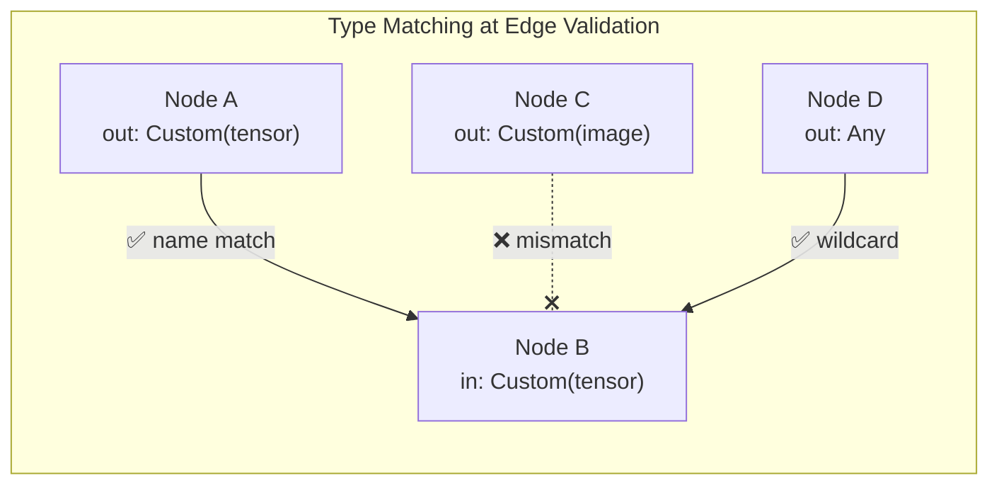
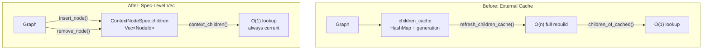

## Week at a Glance

- Added **custom port and value types** — runtime-defined data types for user-created nodes with compiler-enforced type safety
- Moved **children tracking into context nodes** — O(1) child listing with zero cache management
- Removed **dead code**: unused graph hash, 5 speculative event variants, phantom ID types, external children cache
- Added **4 new context presets** (Reactive, StateMachine, BatchParallel, GpuCompute) covering event-driven, stateful, parallel, and GPU execution
- Achieved **zero cargo doc warnings** with top-down rustdoc, decision matrices, and self-documenting API types
- Shipped **190 tests** (147 unit + 24 integration + 19 doc-tests) with benchmarks and runnable examples

## Key Decisions

### Custom Types for Runtime Extensibility

**Context:** Our type system supported six primitive types — booleans, integers, floats, strings, bytes, and a unit type. Every port declared one of these, and the edge validator enforced matching. But when we think about nodes created at runtime — by users designing domain-specific processors or by AI agents assembling pipelines programmatically — there's no way to say "this port carries a tensor" or "this edge transmits a 2D vector." Everything non-primitive had to use a wildcard type with manual byte packing, losing all type safety at the graph level.

**Decision:** We added a named custom variant to both the port type and value enums. A custom port declares a type name (like `"tensor"` or `"vec2"`), and two custom ports connect only when their names match. The corresponding value carries opaque bytes tagged with that same name.

```rust
// ...
Custom(Arc<str>),   // in PortType — name-matched type identity
// ...

// ...
Custom {             // in Value — typed opaque data
    type_name: Arc<str>,
    data: Arc<[u8]>,
},
// ...
```

**Rationale:** This mirrors how the engine already handles built-in types: the type system ensures correct wiring, the runtime just moves values. Custom types extend the same pattern — the engine routes them identically to any other value without needing to understand the bytes. Unlike edge transfer modes (which the compiler must actively implement), custom types are opaque data that flow through the existing propagation machinery.



**Consequences:** Type compatibility checking is now centralized in a single method on the port type enum, replacing two duplicate free functions that had diverged — the UI version was missing wildcard handling, silently allowing invalid connections. Port names are now propagated from templates during instantiation, making ports self-describing for future API queries. The tradeoff is that custom values carry opaque bytes with no runtime type checking beyond name matching — full validation would require a type registry, which is premature until a scripting system materializes.

### No Custom Edge Modes

While adding custom types, we deliberately kept the edge transfer mode enum closed. An edge mode tells the compiler *how* to move data — allocate buffers, check predicates, manage backpressure. A custom mode would be meaningless because the engine can't generate code for an unknown transfer strategy. The five existing modes (direct, buffered, streaming, conditional, sampled) cover the transfer semantics space. New modes get added to the enum when the engine implements them.

## What We Built

### Context Presets for Every Execution Model

With only two presets (dataflow and hardware simulation), creating contexts for other execution models meant manually composing six policy axes and validating coherence. We added four new presets covering the most common patterns:

| Preset | Execution Model | Use Case |
|--------|----------------|----------|
| Reactive | Event-driven, stateless | UI bindings, sensor streams, live dashboards |
| StateMachine | Event-driven, persistent state | FSMs, accumulators, counters |
| BatchParallel | Scatter-gather, CPU parallel | Map-reduce, ETL, data transforms |
| GpuCompute | One-shot, GPU scheduling | Shader compute, ML inference |

All six presets now live in a single file as inline module blocks — each is just a factory function returning a policy struct, and having them side by side makes the axis combinations easy to compare at a glance. The full combinatorial space is 112 valid policies (8 archetypes × 7 scheduling variants × 2 purity modes), and any combination beyond the presets can be built with the policy builder.

### Complete Core-Lib Test Suite

We went from partial test coverage to 190 tests across the foundational crate: unit tests for every previously untested module, integration tests validating constructive patterns, doc-examples on all key APIs, and criterion benchmarks across six type groups. Error types now implement `Display` and `Error` for clean `?` propagation. Port types and boundary directions gained `Hash` for use as map keys. Four pre-existing clippy warnings were fixed along the way.

## What We Removed

This week was as much about subtraction as addition. We removed five categories of dead code, each with a clear rationale:

The **graph hash** module computed a deterministic fingerprint over every node, port, edge, and policy field. It was designed for structural change detection, but the generation counter already provides O(1) staleness checks — and no production code ever called the hash function.

Five **execution event variants** (node scheduled, node completed, tick started, tick committed, timeline jumped) were left over from a deleted tick executor. They occupied core-lib's type layer but described execution concerns that belong in the graph API. The event enum is now focused: six variants matching exactly what the command API produces.

The **edge ID type** was a SlotMap key for edges, but edges have always lived in a flat vector — the SlotMap was never allocated. Similarly, an **input key wrapper** type existed solely to dress up a `u32` config value as a named type; it was used by exactly one node type and added nothing that a plain integer didn't provide.

Finally, the **external children cache** — a HashMap with generation-based staleness tracking — became redundant after we moved children tracking into context node specs. The spec-level vector is always current, maintained automatically by insert and remove operations, with no refresh calls needed.



## Developer Experience

### Self-Documenting API for AI Consumers

We established a three-layer documentation architecture: rustdoc is the authoritative technical reference, architecture docs provide high-level overviews, and a future learn guide will serve end users. The key principle: an AI agent reading `cargo doc` output should understand the full policy system — coherence rules, capability implications, boundary sync modes — without opening any markdown files.

Every policy enum variant now has a decision table showing its behavior, requirements, and capability implications. The capability derivation function documents its complete implication rule set. Module-level docs flow top-down: parent modules introduce the domain with overview tables, child types focus on their own concerns and link upward for context.

We went from 59 broken intra-doc links to zero. The fix patterns: module-level `//!` docs need `crate::` paths (not `self::` or bare names), item-level `///` docs can use bare names when types are in scope, and cross-crate types use backtick-only formatting since rustdoc can't resolve them.

## Considerations

> We chose name-based type matching for custom ports over a full type registry, accepting that custom values are opaque bytes with no runtime validation beyond name equality. This is the right tradeoff for now — a type registry would require a plugin/scripting system that doesn't exist yet, and name matching gives us the type safety we need at the graph wiring level where it matters most. When runtime scripting arrives, the registry can layer on top without changing the port type enum.

> Moving children into the context spec means each insert/remove does an O(k) retain on the parent's children vector, versus the old approach of deferring everything to a batch cache rebuild. For typical context sizes — tens to hundreds of children — this is negligible, and it eliminates an entire class of "forgot to refresh the cache" bugs.
