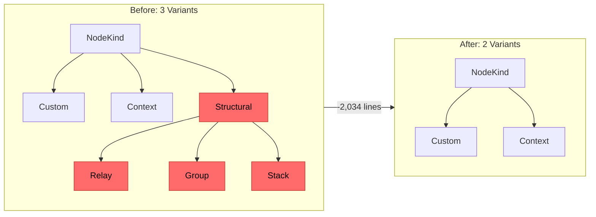
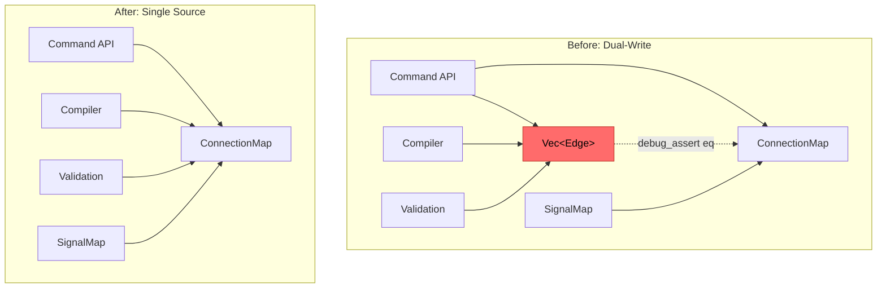
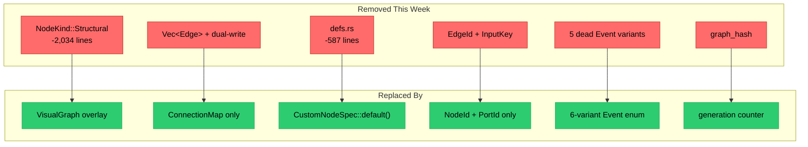
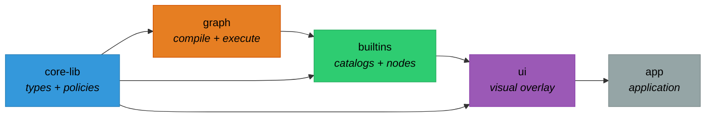

## Week at a Glance

- Removed `Structural` from `NodeKind` — the node model is now **2 variants** (Custom, Context), deleting relays, groups, and stacks (-2,034 lines)
- Replaced `Vec<Edge>` with **ConnectionMap as the sole connectivity store** — one source of truth, zero dual-write
- Added **Custom port and value types** for runtime extensibility — user-defined typed data flows with compiler-enforced safety
- Shipped a **machine-readable CatalogManifest** — AI models can now discover all node types and context presets via JSON
- Deleted bootstrapping artifacts (defs.rs, EdgeId, InputKey, graph_hash, dead events) — ~900 more lines removed
- Renamed the `graph-api` crate to just `graph`, and added comprehensive rustdoc with decision matrices across all layers

## Key Decisions

### Two-Variant NodeKind

**Context:** The node model had three variants — `Custom` (compute), `Context` (containers), and `Structural` (relays, groups, stacks). Structural nodes existed to support visual routing and organizational grouping within the graph.

**Decision:** Remove `Structural` entirely. NodeKind is now `Custom | Context`, period.

**Rationale:** With the visual layer moving to `VisualGraph` as a separate overlay, structural concerns no longer belong on the backend node type. Relay alias resolution added complexity to the compiler and signal map for something that's purely a rendering concern. Cross-context wiring now uses direct edges — simpler, faster, fewer special cases.

**Consequences:** The compiler lost its relay alias pass. Visual grouping and stacking will be handled entirely in the UI layer. Any future relay-like behavior can be expressed as a `Custom` node with a passthrough eval function, keeping the type system clean.



### ConnectionMap as Sole Connectivity Store

**Context:** Graph connectivity was stored in both `Vec<Edge>` and `ConnectionMap`, with dual-write machinery keeping them synchronized and debug assertions checking equivalence.

**Decision:** Delete `Vec<Edge>`. ConnectionMap is the only connectivity representation.

**Rationale:** Two sources of truth is one too many. The dual-write pattern was a migration bridge — ConnectionMap had proven itself stable across several releases. Every consumer (compiler, validation, signal map) already preferred ConnectionMap's O(1) queries over linear edge scans.

**Consequences:** Custom serde that serializes a `"connections"` key and migrates the old `"edges"` key on load. All validation passes, the compiler, and the executor read from ConnectionMap directly. 256 test `edges.push()` calls migrated to `connect_unchecked()` across 18 files.



## What We Built

### Custom Port and Value Types

The type system previously supported six primitive types. Custom nodes created at runtime — whether by users or programmatically via an AI agent — had no way to express typed data beyond an opaque byte buffer.

We added name-based custom types that integrate with the existing type compatibility system:

```rust
// ...
Custom(Arc<str>),  // e.g., "tensor", "audio_frame", "point_cloud"
// ...
```

A node declaring a custom port type only connects to matching custom ports. The compatibility checker handles this automatically — including the `Any` wildcard that accepts everything. We chose name-based matching over a full type registry deliberately: a registry would require upfront registration and versioning machinery that's premature until the scripting system materializes. Names give us type safety today with zero ceremony.

### Machine-Readable Catalog Manifest

With 51 node types and 13 context presets, discoverability matters. We built a serializable manifest that describes every available primitive:

```rust
// ...
let manifest = CatalogManifest::from_builtins();
let json = manifest.to_json();

// Filter by context capabilities
let fpga_nodes = manifest.for_context(&fpga_policy);
// ...
```

Each node description includes port definitions, config fields with defaults, capability requirements, and which contexts accept it. This is the data layer that will power the future MCP server — where an AI model queries available primitives before constructing a graph programmatically.

### GraphRunner and New Node Categories

We added a facade that coordinates the five objects needed to run a graph (compiled graph, signal table, dirty set, worklist, buffer table) behind a single struct. Three time-aware nodes (tick counter, clock, sample-and-hold) and four control nodes (clamp, lerp, deadzone, threshold) bring the library to 51 total — covering the most common signal processing and control system patterns.

### Context Policy Presets

Four new presets joined the existing DataFlow and FPGA policies: Reactive (event-driven pipelines), StateMachine (stateful FSMs), BatchParallel (scatter/gather processing), and GpuCompute (best-effort GPU scheduling). Each preset is a pre-validated combination of the six policy axes, and all pass coherence checks out of the box.

## What We Removed

This was a week where the delete key earned its keep. The philosophy: if it's not pulling its weight, it shouldn't be in the codebase.



**NodeKind::Structural** (-2,034 lines) — relay, group, and stack types plus their compiler support. Visual concerns move to the UI layer where they belong.

**Vec\<Edge\>** — the original connectivity store, replaced by ConnectionMap. Zero dual-write, zero cache equivalence checks, one source of truth.

**defs.rs** (-587 lines) — a bootstrapping artifact from before the builtin category system existed. Test-only factory functions that duplicated `builtins::categories`, plus a `standard()` function that was just an empty `CustomNodeSpec`. Replaced with `impl Default for CustomNodeSpec` and `from_parts()` — same convenience, zero indirection. The 15 factory structure tests moved to their canonical home in `builtins/tests/`.

**EdgeId and InputKey** — phantom types in the ID module. EdgeId was never used (edges live in a `Vec`, not a `SlotMap`). InputKey was a config wrapper masquerading as a graph identity. Both removed, leaving only `NodeId` and `PortId` as the two true graph identities.

**Five dead Event variants** — execution events left over from a deleted tick executor. Event is now a focused 6-variant enum matching exactly what the Command API produces.

**graph_hash** — a deterministic FNV-1a fingerprint over the entire graph structure. The generation counter already handles all staleness detection. Structural fingerprinting can come back from git history if cross-instance identity comparison ever becomes a real use case.

## Performance

### O(1) Children via Inline Vec

Listing a context's children previously required an O(n) scan of the entire node arena, or an external `HashMap` cache with generation-based staleness tracking and explicit refresh calls.

We moved children tracking directly into the context spec — each context maintains a `Vec` of its child node IDs, updated on insert and remove. This gives O(1) child listing with zero cache management. The tradeoff is that each insert/remove does an O(k) `retain` on the parent's children vec, but for typical context sizes (tens to hundreds of children) this is negligible compared to the eliminated cache staleness footgun.

## Developer Experience

The rustdoc received substantial investment this week. Every policy enum variant, the capability bitflags, and boundary sync modes now carry decision matrices directly in their doc comments — an AI agent consuming the API can understand the policy system from rustdoc alone, without reading separate architecture documents.

We also formalized a "top-down documentation flow" convention: parent modules introduce concepts and overview tables, child modules detail their own concerns. This eliminated duplication where preset tables appeared in three different places and ensured readers can navigate from overview to detail predictably.

The crate layer structure after this week's rename:



## Considerations

> We chose name-based type matching for custom ports over a full type registry, accepting that names can collide and there's no versioning. A registry would add ceremony that's premature until the scripting system exists — names give us type safety today with zero infrastructure.

> Replacing `new_standard(id, inputs, outputs)` with `from_parts(id, (inputs, outputs, CustomNodeSpec::default()))` is more verbose at each call site, but eliminates a redundant constructor and makes the API surface smaller and more uniform. One way to create custom nodes, not two.

> Moving children tracking inline means each insert/remove does O(k) work on the parent's vec, versus the old approach of deferring to a batch cache rebuild. For real-world context sizes this is negligible, and it eliminates an entire class of "forgot to refresh the cache" bugs.

## Validation

The workspace maintains full green across all crates: 700+ tests pass with zero clippy warnings and zero doc warnings. The ConnectionMap migration touched 256 test edge insertions across 18 files — all converted to `connect_unchecked()` and verified. Factory structure tests for all builtin node types were preserved during the defs.rs deletion by relocating them to `builtins/tests/factory_structure.rs`.