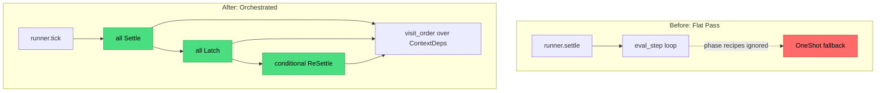

## Week at a Glance

- Finished the **smart-ports migration** and renamed the `compiler` module to `planner` — it plans execution, it doesn't compile
- Stood up an **8-agent ecosystem** with per-agent memory, a spawn matrix, and a spike protocol for cheap idea evaluation
- Shipped the **ContextOrchestrator** — the top-level sequencer that finally makes heterogeneous-policy graphs honor their declared semantics
- Ran a **three-mode gap audit** as TDD-as-discovery at architectural altitude; landed all four top unblocks (catalog policy enum, multi-pass analyzer, transactional policy swap, pull-model event bus)
- Added a **framework-owned PersistentStateTable** so the Accumulator archetype can actually accumulate — no more `Arc<Mutex<T>>` closures
- Fixed a subtle **SlotMap re-insertion hazard** in undo via a minimal `NodeIdRemap` translation primitive
- Enriched tester and benchmarker agents with taxonomies + delegation access from four peers each

## Key Decisions

### The Conductor Was Missing

**Context:** I had spent weeks building beautiful per-context phase recipes — Settle, DirtySettle, Latch, ReSettle, FlushBoundary — but when I composed a graph with a DataFlow parent, a Reactive child, and a StateMachine sibling, `runner.settle()` silently ran one flat oneshot pass. All that policy machinery existed. Nothing dispatched it.

**Decision:** Introduce a **ContextOrchestrator** — a topological sequencer over per-context phase recipes — and make `GraphRunner::tick()` compose three global phases across it: all Settle → all Latch → conditional ReSettle.

**Rationale:** The spike that surfaced this ran four non-FPGA probes (DataFlow↔DataFlow, DataFlow→Reactive, StateMachine+accumulator, DataFlow→BatchParallel). The probes proved the mechanic already existed — `BoundarySyncMode`, phase recipes, merged topological eval steps. What was missing was a conductor that visits contexts in dependency order and dispatches into the existing primitives.

**Consequences:** Single-context graphs get a zero-overhead fast path via `is_single_root()` — the orchestrator is built but never driven. Multi-context heterogeneous graphs get the global two-phase latch the architecture spec always demanded. A three-pass tick is the load-bearing detail: inlining `execute_plan(ctx)` per context would let a downstream Settle read an upstream register's post-latch value within the same tick, breaking the two-phase invariant.



A policy-matrix sweep followed landing. 37 parametric tests across all 8 archetypes and 4 boundary-sync modes. The sweep caught a real bug: the initial ready-set sorted ascending by ffi then popped from the tail (highest first), while the in-loop sort used `Reverse` and popped from the front (lowest first). Benign today — but the two directions contradicted, so any future caller trusting the documented tiebreak would have been quietly wrong. Fixed in the same commit.

### Three-Mode Gap Audit at Architectural Altitude

**Context:** The project has three consumer modes documented in CLAUDE.md — User, User+AI, AI-only. Backend mechanics passed their correctness proofs but I had never proven any scenario end-to-end through all three lenses.

**Decision:** Run TDD-as-discovery one level up. Instead of writing throwaway code as the probe, sketch **canonical scenarios per mode** and classify each required API call against what exists.

**Rationale:** The same discovery mechanism that surfaced the missing orchestrator should work at higher altitude. The probe isn't code — it's the scenario itself. Write out "User changes root policy", "AI proposes a graph diff", "AI self-corrects on analyzer errors", and ask which calls they need. The gaps fall out on their own.

**Consequences:** Four top unblocks fell out of 14 canonical scenarios. Surprising finding: **User mode is the weakest of the three**, not the strongest — the backend had matured past the UI. All four unblocks shipped this week in sequence.

## What We Built

### The Four Unblocks

**Catalog policy enumeration (112 valid policies).** The catalog manifest already exposed nodes and presets; it was silent on the 99 policy combinations no curated preset covered. AI agents building graphs had to either know Rust or enumerate blindly. `builtins::policy_matrix::all_valid_policies()` now returns the full 8 × 7 × 2 matrix with suggested labels following the `Archetype[.Sched][.BestEffort][.IO]` convention — `DataFlow.Parallel.IO`, `StateMachine.Gpu.IO`, and so on. `Gpu` is always `BestEffort`, so the redundant suffix is suppressed.

**Multi-pass analyzer.** `validate()` bailed on the first error — fine for humans, terrible for AI self-correction loops that need every problem at once. The new `analyze(&Graph) -> Vec<Diagnostic>` runs every pass unconditionally and stamps each finding with a stable code, severity, and location. Three passes in v1: structural (G001–G010 for roots, orphans, dangling parents, and several more), type (T001 for port-type mismatch), and semantic (S001–S003 for cycles and capability failures). Simulation and suggestions passes wait for next week.

**Transactional `ChangeContextPolicy`.** Before this, swapping a context's policy meant deleting every child, removing the context, recreating it with the new policy, and re-creating the children. NodeIds gone, mid-flight failures impossible to roll back. The new command runs three gates — coherence, per-child capability, cycle semantics — and applies atomically or not at all. Failures collect rather than short-circuit, so an AI consumer sees every blocker in one round-trip.

**Pull-model event bus.** `apply_command` returned events to its direct caller only. Any other consumer — AI session, UI reactive sync, MCP server — had no seat at the table. A designer consult compared callbacks, channel broadcast, and pull-model subscriber ids. The pull model won on principle-fit: no `dyn Trait`, no async runtime coupling, and no subscriber-panics-inside-`apply_command` reentrancy hazard. Each subscriber drains at its own cadence — UI per frame, AI per turn.

```rust
// Per-subscriber cursor, opaque handle, zero dyn Trait.
let sub = graph.subscribe();
graph.apply_command(cmd)?;                     // broadcast happens inside
for event in graph.drain_events(sub) {
    // ... handle at caller's cadence
}
```

### PersistentStateTable — Framework-Owned State

`StateModel::Persistent` had been a declaration with no storage. The only way to hold state across evaluations was an `Arc<Mutex<T>>` captured in an eval closure — five failure modes: `reset()` couldn't reach it, serde lost it, spec clones shared it, introspection was blind to it, hydration wiped it. Four of the eight archetypes shipped as aspiration rather than capability.

The new `StatefulEvalFn` takes a mutable state slice as a third argument, the planner allocates contiguous slot ranges per stateful node, and `GraphRunner::read_state(node, offset)` exposes typed introspection. `SignalTable::reset()` restores both transient signals and persistent state. Registers stay orthogonal — registers are tick-latched D→Q, persistent is event-accumulated arbitrary state. Two mechanisms for two different semantics; visionary confirmed don't unify.

### The Agent Ecosystem

I spent a session scaling from two agents to eight: architect, designer, visionary, gitter, roadmapper, reviewer, tester, benchmarker. Each gets its own memory directory and a domain reference file — architect owns `ARCHITECTURE.md`, visionary owns `VISIONS.md`, and so on. A spawn matrix keeps fan-out bounded: roadmapper orchestrates, a few agents coordinate, and the specialists stay leaves. Mid-week I went back and enriched tester and benchmarker with proper taxonomies — nine test kinds with picking rules, nine perf-measurement kinds ditto — and granted four peers apiece permission to delegate. The trigger was noticing those two agents had been underused in a 5-feature session; the gap was matching the right *kind* of test or measurement to the question, not just running them.

## Fixes

### SlotMap Re-insertion NodeId Hazard

`SlotMap` bumps a slot's version on removal, so re-inserting a node during undo yields a fresh `NodeId` — silently invalidating every prior reference to that node across events, commands, and the graph arena. The hazard had been tagged `TODO(undo-id-remap)` and was the last blocker before grouped undo could land safely. All three `SlotMap` variants share the semantics, so switching variants wasn't an option.

**Tradeoff:** A full `LogicalNodeId` indirection layer would have eliminated the hazard at the type level, but it would have required rewriting every `NodeId` callsite across every crate. The new `NodeIdRemap` is a deliberate minimal surface — a translation table with identity-on-miss fallback — that fixes the hazard for undo without committing the whole system to a new id abstraction.

## Performance

A background benchmarker audit of the session's 8 feature merges caught a surprise: `SignalTable::reset` regressed ~22% on stateless graphs at 1K–10K slots. Root cause: embedding `PersistentStateTable` added two empty `Vec<Value>` fields, and `reset()` unconditionally called `state.reset()` which runs `clone_from(&init)` — even when both are empty, you still pay length check, allocator probe, and Drop bookkeeping. A two-line guard skips the call when state is empty. Verification run confirmed: signal_table/reset/1K down 14%, reset/10K down 6%, reset/1M down 39% — the larger the table, the bigger the win from skipping empty-state work.

I also introduced a `BenchTier` env-var scheme — `XNODLY_BENCH_SCALE={quick|normal|full}` — so the bench suite can smoke-run in under a minute for CI or reach 10M-node multi-context shapes for release validation. Previous max was hardcoded 1M single-context.

## Considerations

> We chose the `NodeIdRemap` minimal primitive over a full `LogicalNodeId` indirection layer, accepting a tiny shared translation surface to avoid touching every callsite in every crate. The heavier fix is still available when a future concrete pressure forces it.

> We kept registers and persistent state as two mechanisms rather than unifying them, accepting a second storage table because register semantics (tick-latched D→Q) and persistent semantics (event-accumulated arbitrary state) want different lifecycles.

> We took the long mechanical smart-ports commit atomically rather than splitting into smaller PRs, accepting a chunky diff because partial renames would break the build.

## References

- [SlotMap crate](https://docs.rs/slotmap/latest/slotmap/)