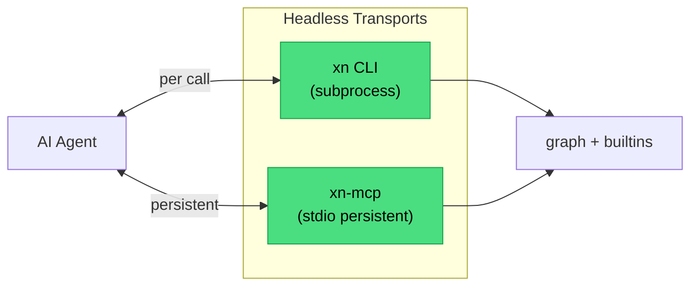

## Week at a Glance

- Shipped two headless transports on the same graph + builtins stack — a short-named **CLI binary (`xn`)** and a stdio **MCP server**
- Hand-authored a **Graph JSON Schema** (draft 2020-12, 20 `$defs`) + a **graph skeleton** so cold-start AI agents have both a spec and a working seed
- Added **5 stateless authoring tools** (`add_node`, `add_context`, `connect`, and two more) — AI-only mode is now COMPLETE for discovery + authoring + validation + execution in one session
- Finished the **five-pass analyzer** with simulation (U001–U003) and suggestions (X001–X002) passes
- Added **`Command::Group`** — a transactional batch with clone-savepoint rollback, unlocking grouped undo for AI bulk edits
- Enriched `NodeDescription` with a **hydrated schema snapshot** — honest ports/hints for `hydrate_fn`-bearing templates
- Cleared the Rust 1.94 clippy backlog under `-D warnings` with one deliberate suppression documented in code

## Key Decisions

### Stateless Pass-Through Over Server Sessions

**Context:** Once the backend stack matured, the question became how an AI agent actually *reaches* it. Linking as a Rust crate isn't an option for most agents. A subprocess CLI works but costs a process launch per request. A long-lived MCP server over stdio removes the launch cost — but what should its session model be?

**Decision:** Every MCP tool is **stateless**. It takes the caller's current `graph_json`, applies exactly one operation, and returns `{ graph_json, events, new_node }`. No server-held sessions. No lifecycle. No crash recovery.

**Rationale:** The alternative — server-held graph sessions — adds concurrency, lifecycle, and crash-recovery complexity with zero gain on the canonical scenarios. Agents already have to own ground truth to survive their own restarts; the server getting in the way just means two copies to reconcile. Pass-through makes every tool trivially concurrent and keeps the transport interchangeable with the CLI — same semantics, different wire.

**Consequences:** The five authoring tools map 1:1 to `graph::Command` variants. `add_node` hydrates from the catalog and accepts optional `config` + `parent` (defaults to root). `add_context` takes either a curated preset name or a full policy axes object — so an agent can pick any of the 112 valid combinations surfaced last week. On-wire `NodeId`s use the `{idx, version}` shape already in diagnostic locations; a new `node_id_from_parts` helper in core-lib gives external consumers a clean inverse without leaking the `slotmap` dependency.



### Hand-Authored Schema Over `schemars` Derives

**Context:** Phase 1 of an AI-only behaviour probe found that an agent with only `xn` or MCP access hits a wall at step zero. The catalog documents every node type and every policy, but says nothing about the outer `Graph { nodes, generation, root_context }` composition. One probe scenario only succeeded by peeking at a serialized example out-of-band.

**Decision:** Ship a JSON Schema (draft 2020-12) + a graph skeleton — *both*, as a pair. The spec lets an agent generate any valid shape; the skeleton gives it a working seed.

**Rationale:** JSON Schema turns validation into an offline, any-language pre-check — agents can self-validate before burning a round-trip through `xn check`. Hand-authored beat `schemars`-derived on every axis except commit count. `Graph` has a custom `Serialize` impl; `SlotMap<NodeId, Node>` doesn't `JsonSchema`-derive trivially; and a hand-authored schema carries agent-facing `description` commentary that the derive would drop.

**Consequences:** The new `graph_schema` and `graph_skeleton` fields on `CatalogManifest` are exposed via `xn export-catalog` and the MCP `export_catalog` tool. Drift is automatic: the skeleton is rebuilt from `Graph::new()` on every `from_builtins()` call — it cannot fall out of sync with the live serde schema. Five lock tests validate both `Graph::new()` and a full FPGA counter against the schema and prove invalid documents are rejected.

### Clone-Savepoint Over Inverse Commands

**Context:** `Command::Group` needed atomic N-command batches so an AI emitting 20 wires lands as a single undo entry — not 20 distinct ones. The re-insertion hazard was cleared last week via `NodeIdRemap`, so nothing blocks the backend primitive any more.

**Decision:** On `Group`, snapshot `nodes + generation + root_context` upfront. Apply children in order. On any failure, restore the snapshot and return `CommandError::GroupFailed { at, inner }`. The event bus is untouched during a group — the outer `apply_command` is the sole broadcast site — so a failed group emits **zero events to subscribers**.

**Rationale:** `Graph` is already `Clone`, the structural fields are small, and clone-savepoint sidesteps inverse-command bookkeeping that every new `Command` variant would otherwise have to maintain forever. Nested groups are rejected at v1 — flattening semantics (error isolation, event segmentation) aren't decided yet.

**Consequences:** Six command variants become seven. Undo stacks can now record an AI refactor as a single atomic group and revert it in one step. Undo UI wiring stays a session concern — the backend primitive is the hard part.

## What We Built

### Two Transports, One Stack

The `xn` binary exposes three subcommands: `check` runs the full analyzer and uses exit codes to gate agent workflows (0 clean, 1 analyzer errors, 2 I/O or parse failures); `run` refuses to execute a graph the analyzer flagged, otherwise settles and ticks; `export-catalog` dumps the full manifest. Clap v4 handles argument parsing, `serde_json` reuses the existing `Graph` serde for zero round-trip drift. The rename from `xtranodly-cli` to `xn` happened mid-session — when a binary is going to live inside agent subprocess calls, every saved keystroke counts.

The MCP server lands on top of the same graph + builtins layer via rmcp over stdio. Three read-only tools in v1 (`analyze_graph`, `run_graph`, `export_catalog`), five authoring tools added immediately after — typed port refs with `TransferMode::Direct` as default, `remove_node` that refuses the root, and structured `ErrorData::invalid_params` responses that preserve the inner error chain so agents can distinguish "unknown type" from "register in stateless root" without parsing prose.

Neither transport depends on `ui` or `app`. The three-mode separation rule — AI-only sessions never drag in winit/wgpu — stays enforced by dependency graph.

### The Fourth and Fifth Analyzer Passes

Last week shipped structural, type, and semantic passes. This week finished the five-pass design:

- **Simulation (warnings):** `U001` dead output — an `OutputPort` with no readers. `U002` undriven input on a compute node. `U003` constant divide-by-zero — a `math.divide` with a `builtin.constant` zero wired to the divisor.
- **Suggestions (info):** `X001` break-feedback-with-register — emitted when `S001` fires, telling the author *how* to fix it. `X002` dead compute node — every output unread, suggest removal.

Exemptions stay conservative to avoid noise. Context nodes are skipped; `builtin.input` is exempt from dead-output and dead-node because it's a boundary source; register variants are exempt from undriven-input because unconnected D/enable/reset are legitimate configurations. The new e2e test `analyzer_u003_divide_by_zero_self_correction_loop` proves the full analyze → fix via Command → re-analyze → run loop end-to-end — exactly the shape an AI self-correction flow needs.

### Honest NodeDescription

`describe_node` used to read static template fields — which drift from reality when a template has a `hydrate_fn`. For constants, `add_const`, and registers, the hydrated shape is what the planner actually sees, and static fields can lie about it. The new path hydrates via `to_def_default()` and snapshots the runtime shape. Three new fields make the hydration honest to AI consumers:

```rust
pub struct NodeDescription {
    // ...
    config_drives_port_types: bool,          // hydrate_fn can rewrite port types
    bake_tag: Option<String>,                // e.g. "Binary(Math(Add))"
    register_details: Option<RegisterSchema>, // flattened RegisterHint
    // ... and several other existing fields
}
```

`config_drives_port_types: true` tells an agent that the inputs/outputs list it sees is a default snapshot, not the full schema. A tester-surfaced spec gap got fixed in the same change: the initial detection compared hydrated default to static type and missed the case where the `hydrate_fn` *can* change types but the default value happens to match the static port type — for instance, a constant with `I64(0)` default. The fix inspects the `HydrateResult` directly; if `port_type_overrides` is non-empty, the flag fires honestly.

## Validation

The cross-feature e2e suite stitched together session features that each had unit coverage in isolation but no combined-workflow tests. Six scenarios: a policy swap mid-execution rejected transactionally and confirmed by re-ticking the counter after the failed swap; the analyze → diagnose T001 → fix via Command → re-analyze → run loop; EventBus drain feeding `SignalGraph::apply_events` and comparing against a fresh build; a valid-policy pulled from `all_valid_policies()` applied via `ChangeContextPolicy` and ticked; and a stateful accumulator surviving both reset cycles and policy swap. TDD-as-discovery surfaced two findings in passing — `Command::AddNode` without parent creates orphans rejected at build time (consistent API, not a bug), and stateful custom nodes pass through policy boundaries because `validate_child` only checks `is_register()` (confirmed correct: they carry state via persistent slots, not register semantics).

## Developer Experience

Rust 1.94 landed 13 clippy errors under `-D warnings`. Twelve were mechanical — `derive(Default)` with `#[default]`, `ok_or_else(|| …)` → `ok_or(…)` for cheap constructors, `depth.map_or(false, ...)` → `.is_some_and(...)`, collapsible `if let` chains flattened with `&&`. The thirteenth — `large_enum_variant` on `NodeKind` — was suppressed deliberately, with the rationale parked in code and memory: boxing would add a deref to `node.type_name()`, `inputs()`, `outputs()` on every validation, planner, analyzer, and UI-sync pass. The 216 B doesn't vanish when you box it, it moves to the heap behind a pointer chase. The real fix — if this ever becomes measurable — is shrinking `CustomNodeSpec` itself via a template/instance split. Not today.

I also finished the `BenchTier` rollout to the remaining bench files (signal_table, signal_map, compile_eval, graph_ops), so every parametric size sweep now reads from `BenchTier::from_env()`. Quick tier in under a minute for CI; full tier reaches the project's actual 10M-node scale target.

## Considerations

> We chose stateless pass-through tools over server-held sessions, accepting a slightly larger on-wire payload per call to avoid owning concurrency, lifecycle, and crash-recovery that would duplicate ground truth the agent already holds.

> We hand-authored the Graph JSON Schema rather than derive it via `schemars`, accepting the upkeep cost to keep agent-facing descriptions, shrink the dependency surface, and sidestep a custom `Serialize` impl that didn't derive cleanly.

> We implemented `Command::Group` with clone-savepoint rollback over per-variant inverse commands, accepting a one-shot clone on group-entry to avoid forcing every future `Command` variant to maintain an inverse.

> We suppressed `large_enum_variant` on `NodeKind` rather than boxing, accepting a per-slot padding tax on `Context` nodes to keep the hot readers (planner, validation, analyzer, UI sync) free of pointer chases — with a documented trigger for revisiting if concrete pressure shows up.