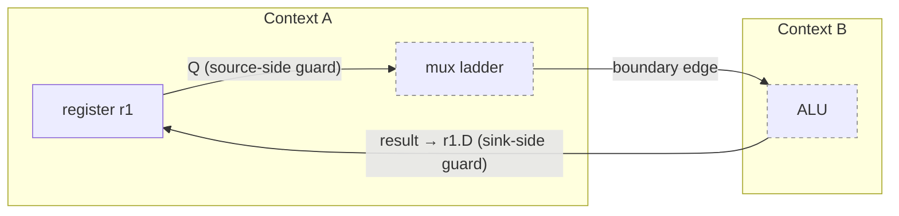
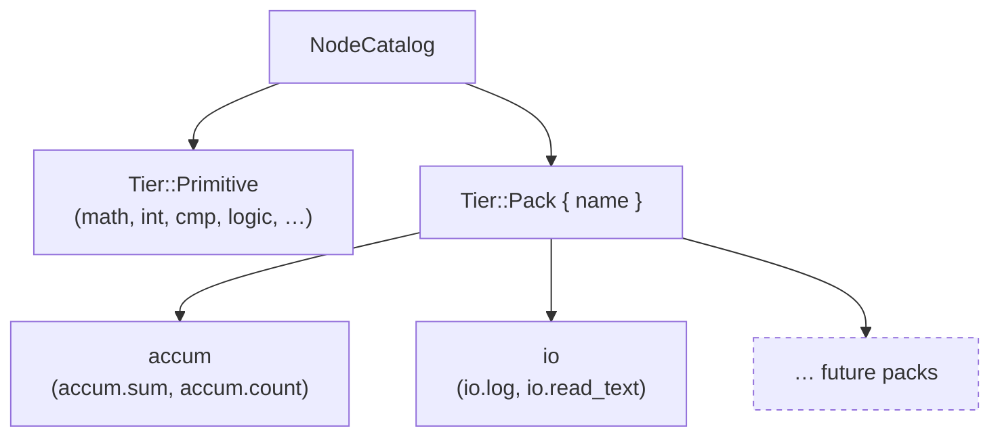

## Week at a Glance

- Closed four silent correctness gaps in the execution substrate — cycle enforcement, preset drift, builder validation, and ignored `inject()` returns — and locked each with a regression test.
- Shipped a 10-row context-conformance harness (~45 tests) that turns archetype contracts into machine-verifiable claims.
- Flattened the preset API to 8 functions, renamed port constants per-node so unary nodes can't silently misroute, and added 1-call `add_node` / `add_context_node` ergonomics on `Graph`.
- Introduced `Tier::Pack` and shipped the first two packs: **accumulator** (running sum + counter) and **io** (stderr log + filesystem read).
- Made `Value::Error` a first-class graph value with workspace-wide propagation, plus a `Recover`-class `error.catch` / `error.is_error` pair.
- Killed two phantom-cycle classes at the cross-context boundary — register Q outputs *and* register state inputs are now both excluded from the context dependency map.
- Added a `catch_unwind` panic-recovery substrate so a bad eval closure surfaces as `Value::Error` instead of taking the host down.
- Re-landed eight typed `int.*` primitives (math + comparisons), justified by an RV32 CPU dogfood that measured the friction empirically.

## Key Decisions

The week's load-bearing architectural moves all share a shape: take an invariant that was *implicitly* true (or hopefully true), and make it *structurally* true.

> **Context:** `presets::io()` was drifting toward becoming a 9th archetype with manually duplicated purity axes. Each future IO-adjacent variant (`audio.io`, `pipeline.io`, …) would reproduce the duplication.
> **Decision:** Add `with_side_effecting()` as a composition verb on `ContextPolicy`. IO becomes an orthogonal property that decorates a base archetype, not a peer.
> **Rationale:** The 8 archetypes are semantic primitives; side-effecting purity is not a primitive — it's a flag that any base can carry.
> **Consequences:** Three preset entries collapse to one-liners. The 8-archetype invariant is restored at the documentation level. New IO callers reach for `dataflow().with_side_effecting()` directly; the old `presets::io()` shim stays for back-compat.

> **Context:** The execution substrate had four correctness gaps that were each tiny in isolation: `DagOnly` cycle detection didn't unify the temporal-edge cut, builder fns silently accepted invalid initial-port-type combos, the state machine preset diverged from the catalog, and `inject()` returned a `bool` that callers routinely ignored.
> **Decision:** Fix all four in one commit, with `inject()` becoming `Result<(), InjectError>` as a deliberate breaking change.
> **Rationale:** Silent misbehavior is the worst failure mode in a correctness-critical engine. An ignored `bool` return *is* the bug, not a workaround for the bug.
> **Consequences:** All callers updated in the same session. Every fix has a permanent regression anchor (`dag_only_register_cycle_regression`, `policy_preset_shapes`, …). The breaking change is loud and obvious at every call site.

> **Context:** Cross-context closed loops where a register Q output crossed a boundary panicked with "Cycle in context dependency graph" — a phantom cycle, because the register break wasn't recognized at the context level. We fixed the source side mid-week, then the RV32 dogfood surfaced the symmetric blind spot: when the boundary edge *terminates* on a register's `D` / `EN` / `sync_reset` / `async_reset` port, the same phantom appeared.
> **Decision:** Add `Graph::is_register_state_input(to_node, to_port)` and a symmetric guard in `build_context_links` that mirrors the existing source-side guard.
> **Rationale:** Registers break cycles on *both* sides — both the temporal output and any state-mutating input are equally non-activating within the current tick. The asymmetric guard was a half-truth.
> **Consequences:** A new architectural invariant now lives in `ARCHITECTURE.md`: "Registers break cycles symmetrically." Twelve regression tests cover both the helper and the planner integration. Seven multi-context dogfood projects (PID, cascaded PID, 5-context with Accumulator, RV32 register-file mux, …) match Python references bit-for-bit.

The shape of the symmetric guard:



Both edges leave the cross-context dependency map untouched — the cycle is real at the *graph* level (it's a closed feedback loop) but not at the *context-scheduling* level (the register breaks it within a tick).

## What We Built

**The conformance harness.** Until this week there was no systematic way to verify that each context archetype actually behaved like its declared `ContextPolicy` axes claimed. Gaps lived in scattered ad-hoc tests. The new 10-row harness covers `DataFlow`, `FPGA`, `StateMachine`, `Pipeline`, `ClockSample`, `Reactive`, `Animation`, `Sensor`, `Control`, `StateChart` — Phase 0 verifies policy shape, Phase 1 verifies end-to-end execution semantics. `cargo test` count grew from ~1020 to ~1092, with two builtin capability declarations fixed in the process so every row runs without `#[ignore]`.

**Tier-2 packs.** Builtins now have a `Tier` discriminator: `Primitive` (always available) vs. `Pack { name }` (opt-in, named bundles).



The aggregator skeleton landed first, then two real packs:

```rust
// the registry pattern (simplified — 2 packs of many)
pub fn register_all(catalog: &mut NodeCatalog) {
    accum::register_all(catalog);
    io::register_all(catalog);
    // ... future packs land here
}
```

Pack #1 is the **accumulator**: `accum.sum` (F64 running sum + RESET) and `accum.count` (Bool pulse counter → I64 + RESET), both stateful. Pack #2 is **io**: `io.log` (stderr) and `io.read_text` (filesystem), the first `SIDE_EFFECTING` pack. Each closes a row of the conformance harness — `accum` lights up the EventProcessing archetype (row 11), `io` validates the side-effecting capability gate (row 12).

**`Value::Error` as a substrate.** When `io.read_text` and `io.log` needed to surface runtime failures, the existing `Value` variants had nowhere to put them. The natural choice was a typed error variant:

```rust
pub enum Value {
    F64(f64),
    I64(i64),
    Bool(bool),
    // ... other variants ...
    Error(GraphError), // new — propagates through baked ops, first-operand-wins
}
```

Once that landed, the consolidation pass added `ErrorBehavior { Passthrough, Recover }` as manifest metadata so AI consumers and palette UIs can discover which nodes participate in error recovery, and `error.catch` / `error.is_error` became the first `Recover`-class nodes.

**Ergonomic graph authoring.** The Graph API gained 1-call `add_node` / `add_context_node` helpers. The preset API flattened from sub-modules with `policy()` fns to 8 flat functions. Port constants — previously `OUT = PortId(2)` everywhere, which silently referenced non-existent slots on unary nodes — are now per-node semantic names (`ADD_A`, `ADD_B`, `ADD_OUT`, `NEG_IN`, `NEG_OUT`, …). Roughly 95 call sites migrated in one pass.

**Typed integer primitives, justified by data.** The `int.*` family (`int.add`, `int.subtract`, six `int.cmp.*` variants) had been landed once, then explicitly reverted at the user's direction: *"build the CPU with sandwiches, log friction, decide on `int.*` from data after."* The RV32 4-register CPU dogfood produced the empirical record — every dynamic-operand integer add was a 4-node cast sandwich, every I64 comparison required an upstream `cast.i64_to_f64`. Eight typed siblings now live alongside their F64 cousins. The catalog grew from 60 to 68 nodes.

## What We Removed

The preset module lost a bunch of indirection. The sub-module-with-`policy()`-fn pattern became 8 flat functions. Four `extract_id()` test helpers vanished. The `accumulator` pack name shrunk to `accum` (the longer name was an imprecise placeholder). Nine empty `policy()` re-exports fell away. None of this changed behaviour — it's pure cliff-clearing before the next round of pack work.

## Patterns & Techniques

**Decorator on `ContextPolicy`.** Rather than letting "side-effecting" become an axis, it became a method:

```rust
let policy = presets::dataflow().with_side_effecting();
// .label gets "DataFlow.IO", .purity flips, base axes unchanged
```

The pattern composes: any base preset can decorate. The decoration is idempotent (calling it twice is harmless). It opens a door without forcing the door's shape on every consumer.

**Pack registry as additive schema.** `Tier` is a new field on `NodeTemplate`, but `NodeDescription` carries it with `#[serde(default)]` so old catalog JSON deserializes cleanly. Pack registration is one call into the aggregator. Future packs (visual nodes, audio, networking, …) plug in without forking the catalog API.

**Test-before-feature for substrate invariants.** Before pack #1 went near a real stateful node, three regression suites locked the substrate behaviours that pack work would stress: `SIDE_EFFECTING` capability gating, hydration restoration of stateful closures, and `runner.reset()` returning persistent state to seeds. Nine new tests, before any pack code touched the planner. When pack tests later failed, the substrate was already known good — failures pointed straight at pack logic.

## Fixes

The week's two most consequential fixes are the symmetric pair on the cross-context dependency map. The first guard, mid-week, fixed the source side — register Q outputs that cross a boundary no longer record a hard context-level dep. The second guard, after the RV32 dogfood found a real-world mux-driven sink-side case, mirrored the same logic to register state inputs. Both guards consult `EvalHint::Register` directly rather than going through a trait abstraction — variant-agnostic across all six builtin register variants and forward-compatible with user-defined registers carrying the same hint.

The four-substrate-fix commit — cycle enforcement, preset divergence, builder validation, `inject` returning `Result` — closed silent gaps that had been lurking. None caused a test failure beforehand, but each was a landmine that would mask real errors during validation. The `inject` change was the most disruptive (every caller updated) but also the one most clearly worth the churn — the `bool` return was the root cause, not a symptom.

The `catch_unwind` substrate finished the week. Any panic inside an eval closure or stateful eval closure now converts to `Value::Error` instead of unwinding the entire `runner.tick()` call stack. Stateful nodes snapshot their state slots before the call and restore on panic, so partial mid-mutation writes never leak. Per-node failure granularity is preserved: neighbouring nodes keep running. Public API signatures didn't change.

## Considerations

> We chose `Value::Error` as a first-class variant rather than a wrapping `Result<Value, _>` — accepting that error-aware code now lives at every match site, but gaining clean propagation through baked ops and serde without a separate channel.

> We landed `int.*` typed siblings rather than making `math.*` polymorphic — accepting catalog surface growth (60 → 68 nodes) so the planner's `EvalHint` dispatch stays additive instead of regressing across 60 existing nodes.

> The `catch_unwind` boundary lives inside the per-closure dispatcher rather than at the public runner API — accepting that `ContextDispatch` executors and a `strict_panic` mode are explicit follow-ups, in exchange for stable `tick()` / `settle()` signatures and per-node granularity.

> Binary error propagation is first-operand-wins — accepting that the second operand's error is silently dropped, rather than allocating an error-set on every binary node. Deferred until a concrete need surfaces.

## Validation

The workspace test count climbed from ~1020 at the start of the week to ~1180 at the end, across about a dozen new files and dozens of new inline tests. Every fix carries a permanent regression anchor. Every architectural invariant has a locking test that fails when the invariant is violated. Twelve new tests cover the symmetric register-state-input guard alone (six on the helper, six on the planner integration). Seven multi-context feedback dogfoods now match Python references bit-for-bit (max diff: `0.0e+00`). Clippy stays at `-D warnings` clean.

## References

- [`std::panic::catch_unwind`](https://doc.rust-lang.org/std/panic/fn.catch_unwind.html)