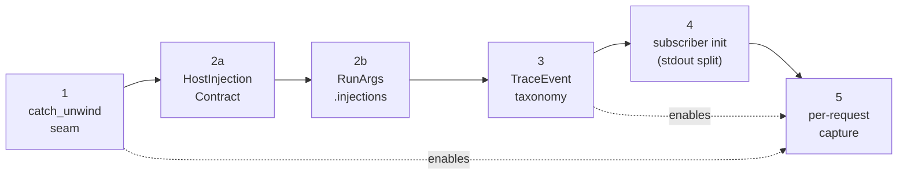
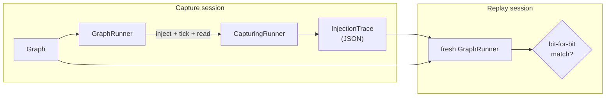
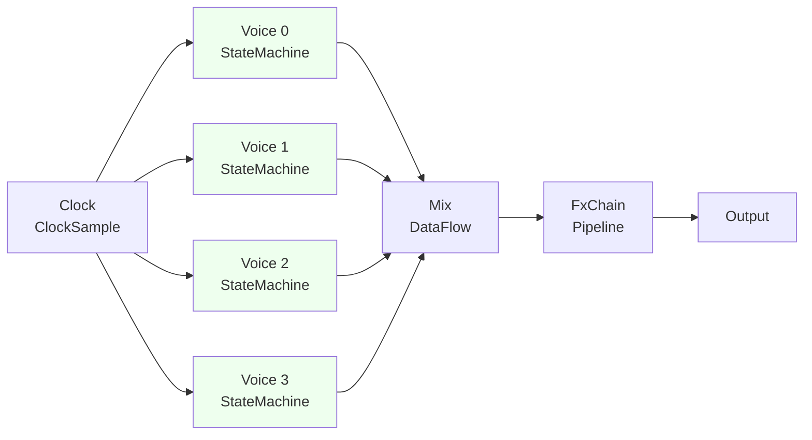

## Week at a Glance

- Closed a 6-step observability rollout: typed orchestrator errors, host-injection contracts on the catalog manifest, per-request injections on `run_graph`, a `tracing` lifecycle taxonomy, subscriber wiring with stdout/stderr split, and an MCP trace-envelope on the response.
- Locked the `type_name` naming convention (2-level default, 3-level via splitter test, hard cap at 3) and migrated `int.cmp.*` into its own module to match.
- Shipped two TDD-outside-in dogfoods end-to-end — sensor-fusion (IoT dashboard) and a single-voice synth + FX chain — followed by a multi-voice polyphonic synth that finally exercised opt-in inter-context parallelism.
- Landed a deterministic replay harness (capture every inject + read, serialize to JSON, replay against a fresh runner with bit-for-bit assertion) and exposed it through `xn run --capture` / `xn replay`.
- Added `GraphRunner::run_cycle()` so AI agents pick the right driver from policy mix without knowing engine internals; surfaced `requires_capabilities` on the catalog manifest with an `archetypes_for` helper.
- Wired `TransferMode::Conditional` and `Sampled` through the planner — `Conditional` became real predicate-gated copies, `Sampled` documented as alias-of-`Direct` until queue-based modes diverge.
- Picked up real perf wins: per-context contiguous slot allocation (-8.7% on the multi-counter case) and dropping unconditional span allocation + a redundant `catch_unwind` (10/100-node tick: 408→386 ns / 3926→3805 ns).
- Removed the `FPGA` preset (alias of `StateMachine`) onto an archive branch to slim the system while the rest of the architecture matures.
- Spawned a new **prober** agent that simulates an external AI consumer end-to-end — caught five friction points in the AI authoring loop on its first dry run, then two self-findings (mandatory artifact persistence, durable storage) on its first real session.

## Key Decisions

> **Context:** The MCP server reads/writes JSON-RPC on stdin/stdout. A stray `tracing` line to stdout would corrupt the protocol; the Python client would silently fail.
> **Decision:** Subscriber init lives in *each* binary, not a shared crate. The end-user binary writes pretty stdout + file; the MCP binary writes stderr + file only.
> **Rationale:** Any shared abstraction would need an `is_mcp` toggle whose only job is gating that footgun. The asymmetry is a hard contract, not a configuration choice.
> **Consequences:** A locked architectural invariant: `mcp-server` stdout is sacred. The init helpers enforce it by construction. A new test surface (`tests/trace_capture.rs`, `tests/injections.rs`) keeps it that way.

> **Context:** AI agents authoring graphs through MCP had to call the right `tick()` / `settle()` / `dirty_settle()` based on policy mix — and getting it wrong silently produced wrong output. The visionary's first framing was `run_until_quiescent()`.
> **Decision:** Reject "quiescent." Ship `run_cycle()` instead.
> **Rationale:** "Quiescence" is undefined for `Ticked` graphs (they tick forever, no fixed-point). `run_cycle` maps to "one unit of forward progress" without implying convergence. It's accurate for all four dispatch paths (`Settle`, `DirtySettle`, `Tick`, `BatchSettle`).
> **Consequences:** AI authors get a single entry point: `runner.run_cycle()` returns a `RunCycleKind` so the agent sees what just happened. Precedence is `Ticked > Reactive > Batch > DataFlow` — a graph mixing `Ticked` and `Reactive` must tick, else the `Ticked` sub-context's registers silently fail to latch.

> **Context:** Until now, node `type_name` shape was set by precedent. Each new domain root invited drift.
> **Decision:** Lock the convention. 2-level default (`<domain>.<op>`), 3-level (`<domain>.<family>.<op>`) only when the splitter test passes, hard cap at 3 levels. Reserved roots: `builtin.*`, `user.*`, `test.*`, `pack.*`. Module layout follows the convention — `int.cmp.*` migrates from `comparison.rs` to `int/cmp.rs`.
> **Rationale:** An unwritten convention quietly drifts every time a new domain shows up. Same status as the observability invariants — the contract decays silently if maintenance isn't a real obligation.
> **Consequences:** No retroactive migration of existing `math.*` (F64-default stays). Two new dogfoods (sensor + synth) get to apply the convention from day one — first time we exercise 3-level real-world families (`audio.osc.*` with 4 siblings, `audio.fx.*` with 3).

> **Context:** Inter-context parallelism via `rayon::scope` was the longest-running visionary item. The first cut shipped with a per-rank fallback: any rank whose contexts contained `StatefulCustom` steps fell back to sequential, because `ParallelTableGuard` only modeled the transient signal table. The multi-voice synth was the first dogfood with real same-rank stateful cohorts — and it failed the "uses ≥2 threads" assertion.
> **Decision:** Three independent layers — monotonic-append state allocation, `&mut [Value]`-bounded dispatch, and `StatefulEvalFn`'s type signature — already prove persistent state is *disjoint by NodeId structurally*, not by convention. Lift the fallback. Extend the parallel guard with `get_state_range_mut`.
> **Rationale:** Same-rank contexts have no dep relation, no shared state slots; concurrent dispatch is sound by construction. Determinism is preserved bit-for-bit because each node still produces the same outputs from the same `(inputs, state)` pair regardless of which worker dispatches it.
> **Consequences:** A new "Persistent state is disjoint by NodeId" architectural invariant. The multi-voice TDD wall flips to a positive lock. A determinism canary (two sibling Accumulator contexts, 64 settles, parallel vs. serial bit-for-bit) guards against future regressions.

## What We Built

**The 6-step observability run.** This was the week's longest arc, landed sequentially so each step is its own commit:



Each step is independent enough to land standalone, but they compose: typed errors from step 1 flush as JSON instead of hanging the protocol; the lifecycle taxonomy from step 4 is what step 6's capture layer normalises into structured fields.

The lifecycle taxonomy is a typed enum (`graph.compile.start`, `runner.tick.end`, `orchestrator.error`, …) so renaming a variant or its `as_str()` output bumps a schema version. A locked test (`lifecycle_names_are_stable`) makes that contract real. There are deliberately *no* per-eval-step events — at 75k nodes, per-step traces would be lethal.

**The replay harness.** A 400-line module that captures every `(tick, node, port, value)` injection and read while a graph runs, serialises to JSON via `Value`'s existing serde, then replays against a fresh `GraphRunner` with bit-for-bit assertion. The harness is library-form first; a CLI wrapper followed:

```rust
// xn run --capture trace.json   — record
// xn replay graph.json trace.json [--tolerance exact|f64-1e-9]   — verify
```

The synth dogfood replay round-trip passes bit-for-bit under `ToleranceMode::Exact` across 256 ticks — empirical evidence the runner is end-to-end deterministic for the most complex dogfood today. Mid-week we found a silent gap: pre-tick reads at `tick == 0` failed because `replay()` constructed a fresh runner without ever calling `settle()`. The fix is a single `settled_before_first_tick: bool` flag on the trace, set automatically when capture-side calls `settle()` at tick zero. Replay mirrors the capture's settle/tick sequence — the natural contract.

**Two dogfoods, end-to-end.** Both followed the same TDD-outside-in shape: spec → failing E2E test → designer implementation → bit-for-bit reference fixture → edge coverage.

The **sensor-fusion** dogfood (IoT dashboard) added five new nodes across four new roots: `sensor.synthetic_temperature`, `accum.ewma`, `format.f64_to_string`, `string.concat`, `bool.to_string`. The redundant `accum.count` design (M3 + M4 in the spec) was deliberately picked to surface the long-standing accumulator double-fire bug — but the topology landed clean. A minimal repro (one `Ticked` context feeding one `accum.count` directly) confirmed the bug had been silently fixed by the cross-context temporal-edge guards from the previous week. Phase 4 added 14 edge tests (backpressure last-write-wins, IO purity boundary, sensor disconnect, EWMA alpha=0/1 corners).

The **synth + FX** dogfood was the complex follow-up. It crosses three axes sensor never did: 3-level `type_name` for the first time (`audio.osc.*` with saw/sine/square/tri; `audio.fx.*` with filter/delay/gain), the first end-to-end `Pipeline` use case (FxChain), and audio-rate semantics (256 ticks at 44100 Hz). Phase 1 was a failing E2E. Phase 2 landed nine audio nodes (Robert Bristow-Johnson cookbook biquad, ADSR FSM, circular-buffer delay). Phase 3 chose Path C — author a NumPy reference, capture a bit-for-bit fixture, replace optimistic energy-window assertions with per-sample asserts. Phase 4 added 18 edge tests across oscillator / ADSR / filter / delay / cross-context.

```rust
// the synth replay round-trip lock — abridged
let captured = run_with_capture(&mut runner, /* ticks */ 256);
let trace_json = serde_json::to_string(&captured)?;
let replayed = replay::replay(&graph, &trace_json, ToleranceMode::Exact)?;
assert_eq!(replayed, captured); // 768 injections, 256 reads, bit-for-bit
// ...
```



The capture wrapper is purely additive — `GraphRunner` required zero modifications, which is itself a soundness signal that `inject` / `tick` / `read` / `tick_count` are already the right public surface.

The **multi-voice synth** dogfood arrived last. Eight contexts (4 voices + 4 supporting), ~40 nodes, 256 ticks at 44100 Hz, two assertions: serial-vs-parallel bit-for-bit, *and* the parallel run actually uses ≥2 thread IDs.



Voices V0-V3 sit at the same rank in the cross-context dep graph — they have no dep relation to each other. Under `parallel_inter_context: true`, all four dispatch concurrently through `rayon::scope`. The disjoint-by-NodeId state allocation is what makes that sound. The second assertion was the TDD wall that motivated lifting the stateful-fallback in `ParallelTableGuard`. Phase 4 added 14 edge tests covering voice independence, peak-parallelism stress, monophonic equivalence (multi-voice with N=1 is bit-for-bit equal to single-voice — `math.add(x, 0) = x` is transparent), and full replay round-trip.

**The AI-authoring-loop trio.** Three sibling commits closed the gap visionary articulated as "the AI knows engine internals." `requires_capabilities` (typed bitmask) plus `archetypes_for(caps)` (computes the 8-archetype list on demand from the 112-policy matrix) means AI agents stop grepping source. `run_cycle()` auto-selects a driver from policy mix. The replay harness gives a regression substrate that's reachable from the agent loop, not just Rust integration tests.

**Buffered transfer mode, finally executable.** The `BufferTable` infrastructure had been wired into `ContextPlan` for nine months. The orchestrator's dispatch loop quietly bypassed the recipe, calling `settle_context` / `latch_context` directly. Multi-context graphs with `TransferMode::Buffered` cross-context edges silently dropped values — the FIFO never drained, never flushed. This week wired drain-before-pass + flush-after-pass at the orchestrator seam (gated on `plan.has_buffers()` so the no-buffers fast path stays free), then mirrored the same pattern on the single-root fast path so an intra-context buffered edge inside a single context behaves correctly too. A new `streaming_backpressure.rs` test suite locks the at-capacity contract: silent FIFO drop with FIFO order preserved.

**The prober agent.** A new role-based agent that simulates an external AI consumer through `xn-mcp` + `xn`. Source-blind by design — the discipline *is* the value. Its first dry run surfaced five friction points (welcome instructions undersold the toolkit, `config_drives_port_types` was an undocumented mechanism, no starter-graph endpoint, etc.). All five closed the same day with a `mcp_starter_graph` tool, refreshed `instructions` text, and explicit type-promotion rustdoc. The first real session caught a commit-narrative inaccuracy a build-agent would have missed, and reduced tool-calls-to-success by ~40%.

## What We Removed

Two commits removed the `FPGA` preset onto `archive/fpga-preserved`. The preset was definitionally an alias of `state_machine()` (identical 6-axis policy, only the label differed) — collapsing the alias loses no semantic coverage, and `Latched` / `Ticked` / `FeedbackWithState` invariants are preserved untouched for `Accumulator` and user-defined policies. The strategic gate is recorded: bring FPGA back when 25 distinct projects are consuming xtranodly, on the empirical-grounding theory that re-introducing it before the rest of the matrix has real consumers would conflate framework maturity with FPGA-specific correctness.

The 6-step observability run also removed `OrchestratorPanic::UnexpectedPanic` (and the `next_request_id()` server-minted id counter) once the post-audit hardening pass renamed and tightened the contracts. `#[non_exhaustive]` on the error enum keeps the removal non-breaking for variant-matching consumers.

## Patterns & Techniques

**Reference-first spec authoring.** Synth Phase 1 had energy-window predicates that turned out optimistic — the ADSR's 220-sample attack never reached sustain inside a 64-sample gate. Path C (capture a bit-for-bit fixture from a NumPy reference, replace prose predicates with per-sample asserts) produced the truth. The lesson: numerical assertions ungrounded in a runnable reference reproduce one half-truth as another. The reference *is* the contract.

```text
For numerical dogfoods: ship a re-runnable reference script + committed fixture
BEFORE prose predicates. No range bounds without a fixture.
```

That pattern now lives in `DESIGN_PATTERNS.md` and `CLAUDE.md` as a cross-cutting authoring rule.

**Lifecycle-taxonomy event names.** Free-form string event names would let any one consumer drift the taxonomy the moment someone renames an event for clarity. The typed enum (`#[non_exhaustive]`, ~13 variants today) returns stable dotted names through `as_str()`. Three consumer surfaces — human log readers, AI agents over MCP, analyzer-diagnostic correlators — read the same lifecycle taxonomy.

**Disjoint-by-construction concurrency.** Persistent state is allocated by monotonic-append per node at compile time. Each `StatefulCustom` step gets an exclusive contiguous slot range. Same-rank contexts have no dep relation, no shared state slots. *Therefore* concurrent dispatch through `ParallelTableGuard::get_state_range_mut` is sound. The architectural invariant is what makes the `unsafe` block defensible.

## Performance

Two real wins this week, both surfaced by a `feedback_loop` benchmark decomposition (3-node feedback graph: nested DataFlow + StateMachine vs. flat single-context vs. bare `ExecutionPlan::tick`).

**Per-context contiguous slot allocation.** `SlotIdx` stays globally unique; only the allocation pattern changes. Each context gets a `Range<u32>` recorded on `ContextPlan`. Within-context settle is now cache-friendly, `ParallelTableGuard` can split by range trivially, and `runner.read_context` becomes a one-liner. Bench delta on the multi-counter case: **-8.7% on `tick/counters/100`** (p=0.00). No regressions across 10 benches.

**Hot-path cleanup.** The unconditional `info_span!.entered()` allocated even when no tracing subscriber was attached. Gating on `tracing::enabled!` lets the no-subscriber case skip the span allocation + thread-local enter entirely. The outer `catch_unwind` in `try_settle` / `try_tick` was belt-and-suspenders — every `EvalOp::Custom` and `EvalOp::StatefulCustom` closure is already individually wrapped in `run_recovering`, and the orchestrator's dispatch is panic-free by construction. Dropping both: **408→386 ns** at 10 nodes, **3926→3805 ns** at 100 nodes per tick.

The decomposition also surfaced where the cost actually lives: eval-step floor 59%, orchestrator only 10%. That guides the next perf priority — `SmallValue` for the eval path, not the orchestrator.

## Fixes

The replay harness's pre-tick `settle()` mismatch was the most consequential silent fix. The library shipped at the start of the week with a reasonable-looking contract that broke for the most common case (verifying initial state and combinational settle-time output). It only surfaced because a CLI consumer drove the round-trip end-to-end — the test that locked it would not have existed without that consumer.

The `BufferTable`'s nine-month-old wiring gap closed as a feature commit (the dispatch path was the missing piece) but functionally it was a fix — multi-context graphs with `TransferMode::Buffered` cross-context edges had been silently dropping values whenever a real consumer materialised. None had, until the synth + FX dogfood started shaping the next set of contracts.

The accumulator double-fire bug from the prior month was confirmed silently fixed by the cross-context temporal-edge guards. Two regression tests now lock both halves: `accum.count` fires exactly once per tick when driven by a `Ticked` upstream, *and* closed loops through `accum.*` are still rejected as real same-tick cycles (the architect's separate ruling on persistent-state ≠ temporal-decoupling).

## Considerations

> We chose `run_cycle` over `run_until_quiescent` — accepting an unfamiliar verb in exchange for a name that's accurate across all four dispatch paths. "Quiescence" is misleading for `Ticked` graphs (they tick forever).

> We default `parallel_inter_context: false` — accepting that the headline win sits behind an opt-in flag, in exchange for unconditional bit-for-bit determinism. Final signal values are thread-schedule stable; trace ordering, panic ordering, and Streaming-cap drop ordering are not. Determinism is the contract; performance is the opt-in.

> We extended `ParallelTableGuard` with raw-pointer-arithmetic `get_state_range_mut` (with `#[allow(clippy::mut_from_ref)]`) — accepting an `unsafe` seam in exchange for lifting the stateful-fallback. Soundness rests on the disjoint-by-NodeId invariant established at compile time, not on Rust's aliasing rules.

> We froze the FPGA preset behind a 25-projects gate — accepting that a real archetype is on ice while the rest of the matrix matures, in exchange for not conflating framework-level claims with FPGA-specific correctness today.

## Validation

Workspace test count climbed from ~1180 at the start of the week to over 1400 by the end. Two dogfoods ship with full edge suites (sensor: 14 tests; synth: 18 tests; multi-voice: 14 tests). The synth replay round-trip passes bit-for-bit under `Exact` across 256 ticks. The multi-voice serial-vs-parallel canary stays bit-for-bit while observing ≥2 distinct rayon worker thread IDs. Three new tracing tests capture span trees on the MCP response without breaking the no-subscriber fast path. Clippy stays at `-D warnings` clean. Six per-tick wall-clock-duration tests confirm the perf gate (`tracing::enabled!`) is honoured — zero `Instant::now()` calls when no subscriber is listening.

The prober agent's first session reduced tool-calls-to-success from ~12 (dry run) to ~7 (post-fix), with the F1-F5 baseline empirically closed and one meta-finding (a commit-narrative inaccuracy) caught that no build-agent would have noticed.
