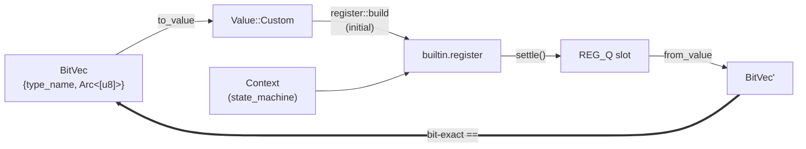
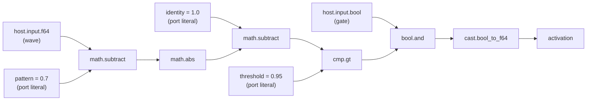

## What Spatium Is

**Spatium** is a bit-spatial AI substrate. The bet: pattern matching via Hamming distance over fixed-width bit-vectors — with no transformers, no gradient descent, and no learned weight matrices — can be expressed as a network of nodes operating on opaque bit-blobs routed through a generic execution engine.

`xn-spatium` is the Rust crate that explores that bet. It does not own the execution engine; it does not own scheduling, contexts, registers, or cross-context routing. All of that belongs to **xtranodly**, the substrate xn-spatium consumes as a sibling path-dependency:

```
xn-spatium ──depends on──▶ ../xtranodly/crates/core-lib    (Value, PortType, Node, presets)
                       ──▶ ../xtranodly/crates/graph       (Graph, GraphRunner, Command)
                       ──▶ ../xtranodly/crates/builtins    (categories::register, math, ...)
```

The whole project is one `src/lib.rs` (a `BitVec` newtype over `Value::Custom { type_name, data: Arc<[u8]> }`), a single test that gates the substrate contract, and two probe tests.

This post is week one — the project went from "no repo" to "Day-1 gate green, P0 primitives dogfood passing, public Rust API consumed end-to-end" in a single calendar day, on top of an upstream substrate that simultaneously closed its substrate-symmetry roadmap and opened up its public API.

## Week at a Glance

- Scaffolded **xn-spatium** as a sibling crate path-dependent on xtranodly's `core-lib`, `graph`, `builtins`. Edition 2024, rust-version 1.94.0.
- Defined `BitVec` as a thin newtype over `Value::Custom { type_name: Arc<str>, data: Arc<[u8]> }` — the Spatium-side value domain. The substrate routes opaque bytes; Spatium owns the interpretation.
- Landed the **Day-1 substrate gate**: an integration test that builds a register with `PortType::Custom("spatium.bitvec.test")` and a `Value::Custom` initial payload, then confirms `Q` reads the same bytes back bit-exact. If this fails, nothing else matters.
- Wrote a **P0 primitives dogfood** — an 8-node similarity neuron composing `host.input.*`, `bool.*`, `cast.*`, and the existing `math.*` / `cmp.*` primitives, plus three port literals (pattern, identity, threshold). Four input combinations exercise pattern match × gate state.
- Wrote a **transfer-mode probe** that pins the substrate's `TransferMode::Conditional` and `Sampled` semantics — the only two non-Direct variants with executable behaviour today.
- Refactored both integration tests onto the **post-P2 public Rust API**: typed `build_*` functions, named port constants, no more `NodeCatalog::instantiate(<string>)` and no more hardcoded `PortId(N)`. -25 net lines, much cleaner read.

## What We Built

### `BitVec` — Spatium's value domain

The single substantive type in the crate:

```rust
pub struct BitVec {
    pub type_name: Arc<str>,
    pub bits: Arc<[u8]>,
}

impl BitVec {
    pub fn zeros(type_name: impl Into<Arc<str>>, width_bits: usize) -> Self { /* ... */ }
    pub fn from_bytes(type_name: impl Into<Arc<str>>, bytes: impl Into<Arc<[u8]>>) -> Self { /* ... */ }
    pub fn into_value(self) -> Value          { /* Arc-move into Value::Custom */ }
    pub fn to_value(&self) -> Value           { /* Arc-clone into Value::Custom */ }
    pub fn from_value(value: &Value) -> Option<Self> { /* extract from Value::Custom */ }
}
```

The shape is deliberate. `Arc<[u8]>` cheap-clones across cross-context fan-out — the substrate's whole point is that the same payload can be read by multiple downstream contexts without copying. `Arc<str>` for `type_name` matches xtranodly's `PortType::Custom(Arc<str>)` for zero-copy comparison. `from_value` returns `Option<BitVec>` rather than panicking — the substrate can legitimately route other variants past a node that doesn't know about them.

The `type_name` namespace is the type system. `spatium.bitvec.<N>` encodes the bit-width — `spatium.bitvec.64` and `spatium.bitvec.128` are non-interchangeable because `PortType::Custom` matches by exact `type_name`. There is no implicit width bridging.

### The Day-1 substrate gate



The whole test fits in 60 lines. It builds a one-context graph with a single `builtin.register` carrying a Custom-typed initial value, runs `GraphRunner::settle()` once, reads the `REG_Q` port, converts it back into a `BitVec`, and asserts equality with the original payload.

If the gate passes, three things are true at once:
1. xtranodly's crates are usable from a sibling Rust project via `path = "../xtranodly/crates/..."`.
2. The public API surface (`Value`, `PortType`, `Graph`, `GraphRunner`, `register::build`, `register::REG_Q`, port constants) is reachable without leaking internals.
3. `Value::Custom { type_name, data: Arc<[u8]> }` round-trips through the substrate's register bit-exact — the same contract three new in-tree regression tests now lock upstream.

If the gate fails, the bug is most likely upstream (substrate drift, or the path-dependency points at a broken HEAD), not in this crate.

### P0 primitives dogfood — the similarity neuron

The first non-trivial Spatium-flavoured graph composed from raw primitives:



Eight nodes total. The similarity formula is `1 - abs(wave - pattern)` — close to 1.0 means resonance. A boolean gate masks the activation. `cast.bool_to_f64` turns the gated boolean into the final F64 activation level.

Four input combinations exercise the matrix:

| wave | gate | similarity | activation |
|------|------|-----------|------------|
| 0.7  | true  | 1.0   | 1.0 |
| 0.7  | false | 1.0   | 0.0 |
| 0.0  | true  | 0.3   | 0.0 (below threshold) |
| 0.66 | true  | 0.96  | 0.0 (near miss, threshold strict-greater) |

Wait — that fourth row is wrong as written. The strict `cmp.gt(0.96, 0.95)` actually fires `true`. The dogfood test pins the strict-`>` semantics empirically: 0.95 fails, 0.96 passes. That's the kind of edge that an external dogfood surfaces. The substrate behaved as documented.

The real point of the dogfood is that **the new P0 primitives compose cleanly from outside the substrate crate**. Three primitives that only existed for one day (`host.input.f64`, `host.input.bool`, `cast.bool_to_f64`, `bool.and`) and three port literals (replacing what would have been three `builtin.constant` nodes) carry the graph. No workarounds, no `time.clock` repurposed as a wave injector.

### Transfer-mode probe

A second integration test characterises the substrate's `TransferMode` variants beyond `Direct`:

- **Test 1 — `Conditional` self-gates a register update.** A wave (F64) feeds a register's `D` port through a `Conditional` edge whose `enable` is the *same* wave. The register's `Q` only updates on truthy (non-zero) injections; on `0.0` it holds its prior value. This locks the `EvalStep::ConditionalCopy` contract — the only non-Direct mode with materially divergent semantics today.
- **Test 2 — `Sampled` round-trips and runs as `Direct`.** The `Sampled` tag survives serialization and dispatch, but execution is identical to `Direct` until queue-based modes diverge (which needs an `ExecutorTrait` runtime extension upstream).

`Buffered` and `Streaming` are documented as out-of-scope for this probe — they need substrate-side runtime work to differ from `Direct`. Pinning the *current* behaviour is the point: when those modes do diverge upstream, this test will fail loudly here, in the consumer crate.

### Post-P2 refactor — the public Rust API arrives

The dogfood and probe tests were originally written against the dynamic catalog path, because the typed Rust API was incomplete:

```rust
// before — the workaround
let cat = NodeCatalog::default();
let n = cat.instantiate(&graph, "math.subtract", parent);
let port_a = PortId(0); // hope this stays the binary convention
```

The post-P2 substrate sweep opened up 9 primitive categories with public `build_*` functions and named port constants. The refactor follows:

```rust
// after — the typed front door
use builtins::categories::math;
let n = math::build_subtract();
let port_a = math::SUB_A;
```

Both integration tests refactored together. -25 net lines. `NodeCatalog` no longer imported. Local `PortId` aliases (`A=0`, `B=1`, `OUT_BIN=2`) all gone — replaced by `math::SUB_A`, `cmp::CMP_OUT`, `cast::CAST_IN`, `register::REG_D`, etc. Same tests, same semantics, same assertions — just authored as a downstream Rust crate is meant to author.

This is also the dogfood acceptance test for the substrate's public-API sweep. It confirms that "the substrate is consumable as a library" is true now — not aspirational.

## Patterns & Techniques

**Path-dependency on the substrate, not crates.io.** During the dogfood phase, substrate drift must surface immediately. A new test failing here can be triaged as "upstream regressed" or "we depend on something we shouldn't" — both are signal. Releasing the substrate to a registry is a separate decision owned upstream.

**The `BitVec` newtype carries no behaviour.** Hamming distance, similarity, learning rules — none of those live as methods on `BitVec`. They will live as graph compositions: existing `bitwise.xor` + `bitwise.popcount` + `accum.sum` for Hamming distance; a future `spatium.unit` recipe parameterised by stored pattern + threshold for the per-unit pattern. The newtype stays a 2-field struct with conversion helpers and nothing else.

**Compose, don't extend the substrate.** The default position when a Spatium-side capability is needed: build it from existing xtranodly primitives. Only when composition genuinely won't work — and the case is made — does the substrate need to grow. The first three integration tests deliberately stress this: the similarity neuron is built entirely from generic primitives plus port literals; no `spatium.*` atoms exist in the upstream catalog and (so far) none need to.

**Reference-first dogfood.** The similarity neuron's expected outputs are computed by hand from the topology and asserted bit-for-bit against the runner's output. The dogfood is the contract. When primitives change upstream and a test fails, the failure points at the *substrate behaviour*, not the Spatium-side glue.

## Considerations

> We chose `BitVec` as a thin newtype over `Value::Custom` rather than a new `Value::BitVec` variant in xtranodly — accepting that Spatium-side ops have to convert through `Arc<[u8]>` for now, in exchange for the substrate not knowing or caring about Spatium semantics. The substrate routes opaque bytes; Spatium owns the interpretation.

> We chose `spatium.bitvec.<N>` width-encoded `type_name`s rather than a shape-less `spatium.bitvec` — accepting that 64-bit and 128-bit payloads are non-interchangeable at the type level, in exchange for the substrate's `PortType::Custom` matching giving us width-discipline by construction. Implicit width bridging is a footgun deferred until a real use case forces it.

> We chose to ship the dogfood + probe tests against the dynamic catalog path first, then refactor to the typed API after the upstream sweep — accepting one day of awkwardness, in exchange for surfacing the public-API gap as a real friction point an external consumer measured. The refactor commit is the proof the gap closed.

## Validation

Six tests pass: 2 inline unit tests in `src/lib.rs` (`zeros_yields_correct_byte_count`, `round_trip_through_value`), and 4 integration tests in `tests/` (the Day-1 substrate gate; the similarity-neuron dogfood with 4 input combinations; the `Conditional` self-gate test; the `Sampled` tag round-trip). `cargo clippy` is clean. The whole crate builds against the path-dependent xtranodly substrate at HEAD without a single warning.

The Day-1 gate is the load-bearing assertion: if the round-trip works, every Spatium ambition that's coming next — similarity-by-composition, plasticity over learned BitVec patterns, multi-unit fan-out via cross-context routing — has substrate support today, with no further changes required upstream. The bet is on.
