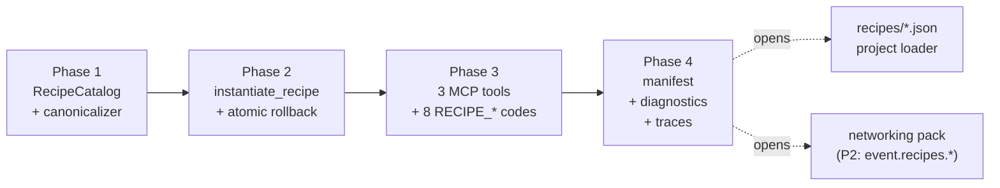
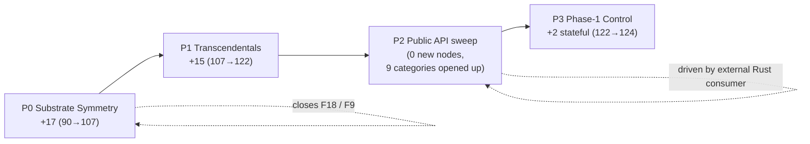

## Week at a Glance

- Shipped **port literals end-to-end**: every `InputPort` can carry an inline literal `Value`, eliminating the constant + connect 2-call pattern for static parameters. Synthesised as `EvalHint::Constant` slots at planning time — zero new `EvalOp` variants, hot path untouched. F9 closure followed: `math.*` / `int.*` / `cmp.*` all opted in.
- Landed **recipes**: composable graph fragments instantiated atomically, hashed by `(recipe_def_hash, params_canonical_json_hash)`, surfaced through three new MCP tools (`register_recipe`, `instantiate_recipe`, `list_recipes`) and an opt-in `recipes/*.json` project loader. Four phases — data model, atomic instantiate, MCP surface, manifest + diagnostics + traces — landed as one coherent arc.
- Shipped the **first non-substrate pack** (`networking`): 8 `event.*` atoms (windowed counters, alarm thresholds, dedup, rate limiters), 3 `event.recipes.*` composable recipes, a log-analytics dogfood, and a P1.5 recipe-extension that lets recipe params bind into atom port literals.
- Closed the **substrate-symmetry roadmap** in four batches (P0–P3): +34 new primitives total, catalog 90 → 124 nodes. P0 added I64 arithmetic + `host.input.{f64,i64,bool}` + casts + native `bool.*` + a 30-node F9 retrofit; P1 added F64 transcendentals; P2 swept the public API across 9 categories; P3 added the first Phase-1 control stateful atoms (`integrator`, `differentiator`).
- Locked the **`Value::Custom × PortType::Custom` register contract** with three regression tests promoted from a torn-down spike. Custom-typed payloads round-trip through `builtin.register` and survive cross-context routing bit-exact — the contract that downstream consumers depend on.
- Re-ran the **Spatium proof-of-concept live** for the first time: 2-unit pattern resonance, 2-wave interference, and EWMA-driven plasticity. All three pass within IEEE drift; all Bool firings bit-exact; the Ticked → Accumulator double-fire fix from earlier holds under live load.

## Key Decisions

> **Context:** AI consumers authoring graphs through MCP routinely needed a 2-node bridge — `builtin.constant` + `connect` — to wire a static parameter onto a node's input port. Empirical measurement on representative authoring prompts pinned this as the single largest unrealised authoring win.
> **Decision:** Make `InputPort.literal: Option<Value>` a first-class field. Connection wins if both are set; literal is the non-destructive fallback. The planner allocates a synthetic constant slot per literal-only port and emits a `constant_init` — reusing the existing `EvalHint::Constant` machinery exactly. Zero new `EvalOp` variants, zero hot-path branches.
> **Rationale:** A new `PortSource::Literal` variant would have forced every existing reader (every `probes/*` graph, every dogfood JSON) to crash on the new variant. The additive field keeps every existing graph round-trip-identical with `literal: None`. Synthetic-constant insertion at planning time avoids inventing a runtime mechanism that already exists.
> **Consequences:** Authoring leverage measured at -60 to -75% tool-calls on representative prompts after the F9 closure landed (`math.*` / `int.*` / `cmp.*` all opt in). The manifest gained a per-port `accepts_literal: bool` so the affordance is discoverable, not inferred. A new trace event `Event::InputLiteralChanged` bumped `TracePayload::schema_version`.

> **Context:** Several authoring patterns were structurally repetitive — a 5-atom biquad filter, a 4-atom event-threshold alarm, the wave-resonance unit a Spatium-flavoured graph would assemble. Recipe-leverage measurements on three representative prompts produced -64% to -83% tool calls per instantiation versus building from primitives.
> **Decision:** Ship recipes as composable, parameterised graph fragments. Body is pre-flattened atoms (DAG-only, no nested recipes). Instantiation is atomic — `apply_group` snapshot extended with `recipe_provenance: SecondaryMap<NodeId, RecipeOrigin>`. Args are hashed by `(recipe_def_hash, params_canonical_json_hash)`; same-args instantiation is deduplicated. Three MCP tools surface registration, instantiation, and listing.
> **Rationale:** The substrate is "valid by construction" via the Command API; recipes inherit that. No nested recipes at runtime — a recipe registers as a flattened atom list, so instantiation never sees recursion. Provenance is structural, not a label: every instantiated node carries a `RecipeOrigin` referencing the parent.
> **Consequences:** Recipes ship as a library + an opt-in `recipes/*.json` project loader. Diagnostics gain a `recipe_context: Option<RecipeOrigin>`, so an analyser failure inside a recipe instance points at the recipe + the offending atom, not just the atom's NodeId. Three new trace events bumped the schema version. Eight stable error codes (`RECIPE_*`) lock the failure surface.

> **Context:** The first real external Rust consumer (a sibling crate path-dependent on `core-lib` + `graph` + `builtins`) surfaced an asymmetric public API. `register::REG_D` + `register::build()` were public; `math`, `int`, `bitwise`, `cmp`, `cast`, `logic`, `control` kept their builders private and their port-id constants as bare `const`. `NodeCatalog::instantiate` worked but forced consumers to hardcode `PortId(0) / (1) / (2)`.
> **Decision:** Sweep all 9 primitive categories in one commit. ~70 new `pub const TYPE_*`, ~142 port-id pub-flips, ~74 new public `build_*` functions. Pure visibility — zero new functionality, zero behaviour changes.
> **Rationale:** The substrate should be "Rust-stdlib-shaped." An asymmetric surface is a hidden tax on every external consumer. Shared port-id names (`IN_A`, `IN_B`, `OUT`) get disambiguated by category prefix (`INT_CMP_*`, `CMP_*`, `CAST_*`) to avoid cross-category clashes once everything is public.
> **Consequences:** The downstream consumer's tests refactored to drop ~25 lines of glue and stopped importing `NodeCatalog` entirely. The dynamic catalog path stays for fully-data-driven authoring (JSON, MCP); typed Rust callers get a typed front door alongside it.

## What We Built

### Port literals end-to-end

Across `core-lib`, `graph`, `builtins`, and `mcp-server`. The synthetic-constant insertion lives entirely in the planner — every literal-only `InputPort` gets a slot, a `constant_init` entry, and is wired to the consumer node like any other constant.

```rust
// abridged — what the planner does for a literal-only port
if input.literal.is_some() && input.source.is_none() {
    let slot = ctx_slot_count;
    ctx_slot_count += 1;
    constant_inits.push((slot, input.literal.clone().unwrap()));
    port_slot_map.insert((consumer, input_port_id), slot);
}
```

The hot path sees a `Value` arrive on a slot — same as it always did. The new substrate is a manifest-level `accepts_literal: bool` (so AI consumers can discover which ports take literals) and the `Command::SetInputLiteral` lifecycle event. F9 closed within a day: every `math.*`, `int.*`, `cmp.*` operand opted in. Two follow-ups landed the same week (F11: U002 diagnostic became literal-aware so an unconnected-port-with-literal stops getting the wrong "undriven" message; F10 + F12: welcome instructions and capability hints surfaced the affordance to MCP consumers).

### Recipes

Four phases shipped as one coherent arc:



Phase 2's atomicity was the load-bearing decision. The existing `apply_group` snapshot extends to include `recipe_provenance: SecondaryMap<NodeId, RecipeOrigin>`. Provenance writes happen *outside* the batch and *inside* the `Ok` branch of `instantiate_recipe`. Failure rolls back as if no recipe instantiation had been attempted. This is what makes recipes safe to layer on top of the existing Command API.

The hashing decision matters too. `args_hash = blake3((recipe_def_hash, params_canonical_json_hash))`. Both axes are load-bearing: a recipe definition can change without its params changing; the same params can be applied to two different recipe definitions. Same-args instantiation is deduplicated — instantiating `biquad_lowpass(cutoff=440, q=0.7)` twice in the same graph reuses the same node ids the second time.

### The networking pack — first non-substrate pack

```rust
// the catalog now distinguishes two tiers
pub enum Tier {
    Primitive,                // always available
    Pack { name: &'static str }, // opt-in, named bundles
}
```

The `networking` pack is the first to land in this shape:

- **P1**: 8 `event.*` atoms — `event.window_count`, `event.alarm_threshold`, `event.dedup`, `event.rate_limit`, `event.field_extract`, and three more — all stateful Combinational with port-with-literal authoring on every static parameter.
- **P1.5**: a `ParamBinding` extension to recipes that lets a recipe parameter bind into an atom's port literal (not just a `config` value). This is the missing link for recipes-of-stateful-atoms — `event.recipes.*` need to forward params into `event.*` port literals, not configs.
- **P2**: 3 `event.recipes.*` composable recipes (`threshold_alarm`, `windowed_rate_alert`, fan-out chain) — by-construction tool-call leverage measured at -72% to -83%.
- **P3**: a log-analytics dogfood that consumes the pack end-to-end with a Python reference oracle for bit-for-bit verification.

The pack also exposes a substrate gap (P4): per-topic Reactive parallelism — same-rank, no shared state — could in principle dispatch concurrently, but the current orchestrator's `parallel_inter_context` rank-grouping doesn't yet model the per-topic case. Tracked as a follow-up.

### F14 — `builtin.register` port-type promotion

Until this week, `builtin.register`'s `D` and `Q` ports were typed `F64` regardless of what `initial` was. A register holding a `Value::Custom` payload would still advertise `F64` ports — a bug that bit at recipe-instantiation time when a downstream `register` appeared in a recipe body with a non-F64 `initial`. The fix is small: `builtin.register` opts in to `config_drives_port_types: true`. Port types now follow the `initial`'s `PortType`. Twelve regression tests cover the matrix.

### Substrate-symmetry roadmap closed (P0–P3)



P0 landed in 5 batches: I64 arithmetic (7 new), `host.input.{f64,i64,bool}` (3 new — closes F18, the "every host-injectable F64 was just `time.clock`" friction), `cast.{bool_to_i64, bool_to_f64, i64_to_string}` (3 new), `bool.{and,or,xor,not}` as native ops alongside `logic.*` (4 new), and a 30-node F9 retrofit covering `bitwise.*`, `control.{select, deadzone}`, `cast.*`, and `logic.*`. New numeric primitives ship under a structured-error contract: `int.divide` and `int.modulo` emit `Value::Error { kind: ErrorKind::OutOfRange, message }` on a zero divisor; `math.divide` keeps its grandfathered Unit fallback for backwards compatibility.

P1 added 15 F64 transcendentals — `math.{sin, cos, tan, asin, acos, atan, exp, log, sqrt, pow, ...}` plus ratio and sign helpers. All baked through existing `BakeHint::Unary` / `Binary` with `OpTag::Math`. Zero new BakeHint variants.

P2 was the public-API sweep above.

P3 shipped two stateful Phase-1 control atoms: `control.integrator` (`accum += in * dt`, RESET-to-seed) and `control.differentiator` (`out = (in - prev) / dt`, first-tick spike documented). Both use the proven `accum.ewma`-style `StatefulEvalFn` + `state_init` pattern; both require `TICKED + LATCHED` capabilities and schedule cleanly inside `StateMachine` and `FPGA`-preset contexts.

### Spatium ran live

Three Spatium-flavoured graphs — 2-unit pattern resonance, 2-wave interference, EWMA-driven plasticity — were re-executed end-to-end through `xn-mcp run_graph`. All three pass:

| Probe | Verdict | Notes |
|-------|---------|-------|
| basic 2-unit | PASS | F64 deltas < 1e-15 (IEEE rep drift only); Bool firings bit-exact |
| 2-wave interference | PASS | Dual host-injection works in a single `run_graph` call |
| EWMA plasticity | PASS | Ticked → Accumulator double-fire fix HOLDS — single-fire trajectory |

Two new friction points surfaced for follow-up: `xn run` doesn't yet accept an injection-schedule flag (host-injected graphs through the CLI silently produce nulls), and `run_graph` returns final-tick state only, so per-tick verification costs N MCP calls.

## Patterns & Techniques

**Port-with-literal as the default for runtime parameters.** The mechanical test: read at tick T+1 — if a different value MUST take effect on T+1 without recompile, it's a port; if you'd recompile anyway, it's `config`. Static parameters that pass the test get `accepts_literal: true` in the manifest.

**Recipes as flattened atoms with structural provenance.** A recipe registers pre-flattened — no nested recipes at runtime. Cycle-checking happens at register time, never at instantiation. Provenance is `SecondaryMap<NodeId, RecipeOrigin>`, which means every node ever instantiated carries (or doesn't carry) a recipe origin trivially queryable at analysis or trace time.

**Tier-1 primitives + tier-2 packs.** The catalog now has a `Tier` discriminator. `Primitive` is always available; `Pack { name }` is opt-in. The pack registry is one call into an aggregator — future packs (audio, networking, visual nodes) plug in without forking the catalog API.

**Public API as the first-class surface.** The substrate going from "reachable through the catalog" to "reachable as `pub fn`" was the single biggest authoring-ergonomics improvement of the week, and it cost zero new functionality. Asymmetric public surfaces silently tax every external consumer.

## Considerations

> We chose `InputPort.literal: Option<Value>` over a `PortSource::Literal` variant — accepting an extra field on the port struct, in exchange for additive serde compatibility (every existing graph JSON round-trips identical with `literal: None`).

> We chose synthetic-constant insertion at planning time over a new `EvalOp` variant for literals — accepting a small planner pass, in exchange for keeping the hot eval loop and existing constant machinery untouched.

> We swept the public API for 9 categories in one commit — accepting a large diff with mostly mechanical changes, in exchange for a coherent surface that doesn't ship in installments and leave half the ecosystem on the old path.

> We grandfathered `math.divide`'s F64 Unit-fallback while moving `int.divide` to structured `Value::Error` — accepting an asymmetry across the numeric domain, in exchange for not breaking any existing graph. New numeric primitives all use the structured contract.

## Validation

Workspace test count climbed from ~1400 at the start of the week to ~1700 by the end. Port literals shipped with ~50 new tests across the 4 affected crates. Recipes added ~80 across the 4 phases (data model invariants, atomic rollback property tests, MCP error-code coverage, manifest/diagnostics/trace integration). The networking pack ships ~60 across P1 + P2. P0–P3 added ~120 tests across the 4 batches. Three new substrate-contract regressions lock the `Value::Custom × PortType::Custom` round-trip across registers and cross-context routing. The Spatium POC's three graphs all match per-tick predictions within 1e-10 (F64) and bit-exact (Bool). Clippy stays at `-D warnings` clean across the workspace.

The first real external Rust consumer — a sibling crate authored against `core-lib` + `graph` + `builtins` as path-dependencies — built and tested green against P0, refactored cleanly onto the P2 surface, and now exercises the substrate from the outside as a real path-dependent crate. That dogfood is what made the public-API gap legible, and what closing it was for.
