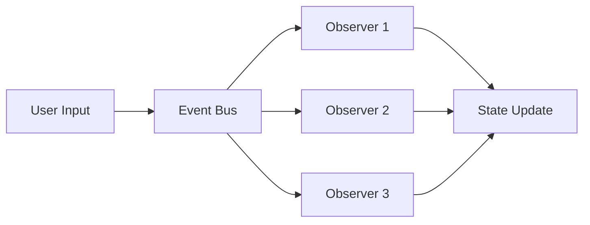

Fake content for testing pagination - post 02.

## Architecture Diagram

```mermaid
flowchart LR
    A[User Input] --> B[Event Bus]
    B --> C[Observer 1]
    B --> D[Observer 2]
    B --> E[Observer 3]
    C --> F[State Update]
    D --> F
    E --> F
```
