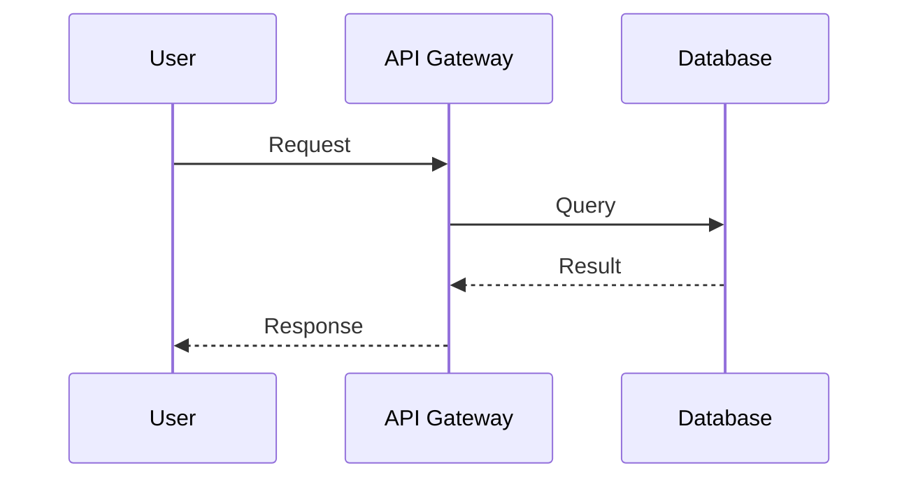

Fake content for testing pagination - post 04.

## Dashboard Preview


## Data Flow



## Implementation

```rust
pub struct OrderService {
    db: Database,
    cache: Redis,
}

impl OrderService {
    pub async fn create_order(&self, order: Order) -> Result<OrderId> {
        let id = self.db.insert(order).await?;
        self.cache.invalidate("orders").await?;
        Ok(id)
    }
}
```
